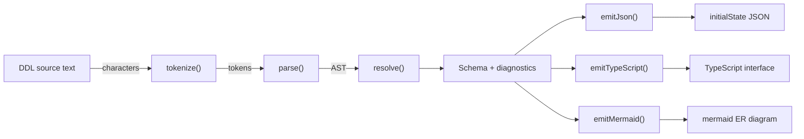
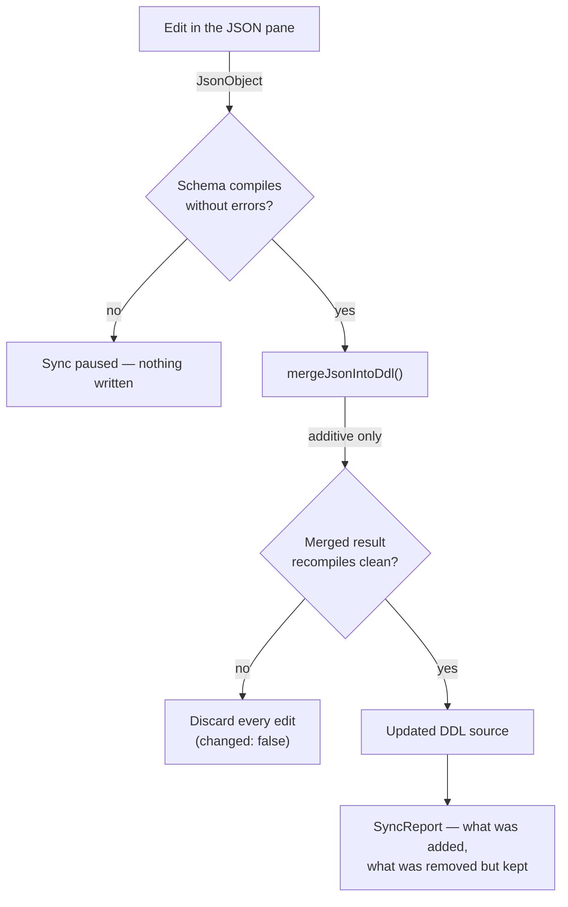
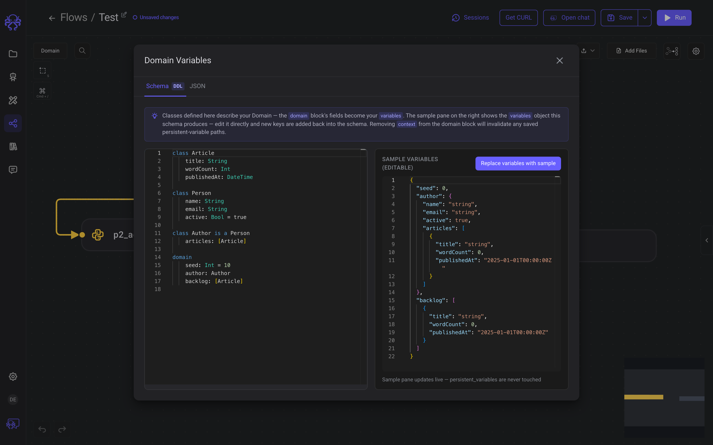
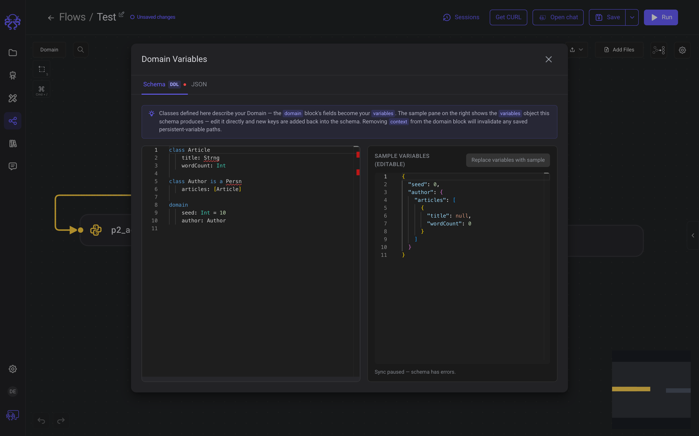

# 🧪 Prototype — DDL Domain Editor

> **This is a prototype branch.** Exploratory, intentionally unrefactored, not reviewed, and
> never merged to `main`. It exists to preserve an idea and to demo it.
> Looking for the project? → [EpicStaff README](https://github.com/EpicStaff/EpicStaff#readme)

**Branch** `proto/ddl-domain-editor-20-08-26` · **Created** 20-08-26 · **From** `main` @ `4b491d02a` · **Status** parked

## What this explores

A flow's Domain is currently authored as raw `initialState` JSON on the Start node — untyped,
undocumented, and re-derived by hand for every flow. This prototype replaces that with a small
typed schema language (a "DDL") written in a Monaco editor: you declare classes and fields, and
one source compiles to three outputs — the `initialState` JSON, a TypeScript interface, and a
mermaid ER diagram.

The Domain dialog becomes two panes — a **schema** pane and a **JSON** pane — kept in step by a
deliberately conservative one-way merge back from JSON into the schema.

## Why it might matter

Every flow author currently invents the shape of `variables` from scratch, and nothing catches a
typo until the flow runs. A schema moves those errors to authoring time — completions and
red squiggles while typing — and hands you a TypeScript interface for code nodes plus a diagram
for documentation, both generated rather than maintained. If it were ever productionised, the
same schema is the obvious place to validate `variables` server-side; that part does **not**
exist here (see *What doesn't*).

## How it works

One source text, one compile, three emitters:



Diagnostics are **collected at each stage rather than thrown**, and `generate()` emits all three
outputs best-effort even when the source is invalid — so the preview keeps updating while you are
still mid-edit.

The interesting half is the other direction. Edits in the JSON pane are merged back into the
schema through a guard that would rather do nothing than corrupt your source:



The merge is **additive and non-destructive by design**: new keys become new properties or
classes with inferred types, existing properties are never retyped or deleted, and keys you
removed from the JSON are *reported* rather than deleted from the schema.

## Screenshots

**A schema and the `variables` object it produces, side by side.** The right pane regenerates on
every keystroke.



**Two typos, and the guard doing its job.** `Strng` and `Persn` are flagged inline, the DDL tab
picks up a severity dot, "Replace variables with sample" is disabled, and the footer reads
*Sync paused — schema has errors*. Note the sample pane still renders best-effort output rather
than going blank.



## What works

- The full `tokenize → parse → resolve` pipeline, with diagnostics staged rather than thrown.
- Three emitters from one schema: JSON, TypeScript, mermaid.
- Best-effort emission while the source is invalid, so the live preview never goes blank.
- Monaco integration — a registered DDL language with syntax highlighting and error markers.
- Editor intelligence: hover, completions, `describeClass`, and did-you-mean suggestions for
  unknown type names.
- The guarded JSON → DDL merge above, with a `SyncReport` of what changed.
- A reusable `<app-ddl-editor>` shared component — OnPush, `input()`/`output()`, no decorators.
- `ddlSource` persisted on `StartNodeData`, so the schema text survives save/load. The dialog
  opens on the schema tab when a source exists and the JSON tab when it doesn't.
- Type-checks clean. The single `tsc --noEmit` error (`Permission` in `role-base-access`)
  pre-dates this branch and is unrelated.

## What doesn't

- **Zero tests.** No specs for the lexer, parser, resolver, emitters, or sync. This is the
  riskiest gap by a wide margin — a hand-written parser with no tests regresses silently.
- **A possible settings-dialog regression.** `_overlays.scss` deletes the
  `.settings-dialog-panel` / `.settings-dialog-backdrop` z-index rules while adding
  `.domain-dialog-backdrop`. Whether that breaks the settings dialog's stacking was never
  verified.
- **No backend contract.** `ddlSource` is frontend-only. It has no Django model field and no
  crew `GraphData` field, so it does not satisfy the cross-layer field name contract and nothing
  validates the schema server-side.
- **The language is undocumented.** There is no grammar reference; `parser.ts` is the only spec
  for what the DDL accepts.
- **Based on a stale `main`.** `4b491d02a` is roughly a month behind `origin/main`, so picking
  this up means a rebase — most likely conflicting in `domain-dialog.component.ts`, which
  carries the +878-line integration.

## Where the interesting code is

| File | What's there |
|---|---|
| [`shared/ddl/core/index.ts:24`](https://github.com/EpicStaff/EpicStaff/blob/proto/ddl-domain-editor-20-08-26/frontend/src/app/shared/ddl/core/index.ts#L24) | `compile()` and `generate()` — the whole pipeline in one readable place. **Start here.** |
| [`shared/ddl/core/parser.ts:246`](https://github.com/EpicStaff/EpicStaff/blob/proto/ddl-domain-editor-20-08-26/frontend/src/app/shared/ddl/core/parser.ts#L246) | The hand-written parser — the heart of it, and the only grammar spec. |
| [`shared/ddl/core/lexer.ts:47`](https://github.com/EpicStaff/EpicStaff/blob/proto/ddl-domain-editor-20-08-26/frontend/src/app/shared/ddl/core/lexer.ts#L47) | `tokenize()` — where diagnostics start being collected instead of thrown. |
| [`shared/ddl/core/resolver.ts:26`](https://github.com/EpicStaff/EpicStaff/blob/proto/ddl-domain-editor-20-08-26/frontend/src/app/shared/ddl/core/resolver.ts#L26) | Inheritance flattening and cycle detection. |
| [`shared/ddl/sync/merge-json-into-ddl.ts:40`](https://github.com/EpicStaff/EpicStaff/blob/proto/ddl-domain-editor-20-08-26/frontend/src/app/shared/ddl/sync/merge-json-into-ddl.ts#L40) | The genuinely tricky part — folding JSON edits back into DDL text, with the discard-on-error safety net. |
| [`shared/ddl/core/service.ts:60`](https://github.com/EpicStaff/EpicStaff/blob/proto/ddl-domain-editor-20-08-26/frontend/src/app/shared/ddl/core/service.ts#L60) | Editor intelligence — hover, completions, did-you-mean. |
| [`shared/ddl/monaco/register-ddl-language.ts:23`](https://github.com/EpicStaff/EpicStaff/blob/proto/ddl-domain-editor-20-08-26/frontend/src/app/shared/ddl/monaco/register-ddl-language.ts#L23) | How the language gets into Monaco. |
| [`shared/components/ddl-editor/ddl-editor.component.ts:52`](https://github.com/EpicStaff/EpicStaff/blob/proto/ddl-domain-editor-20-08-26/frontend/src/app/shared/components/ddl-editor/ddl-editor.component.ts#L52) | The reusable component's API surface. |
| [`domain-dialog.component.ts:1052`](https://github.com/EpicStaff/EpicStaff/blob/proto/ddl-domain-editor-20-08-26/frontend/src/app/visual-programming/components/domain-dialog/domain-dialog.component.ts#L1052) | `attemptMergePaneIntoDdl()` — the integration, and the largest single change (+878 lines). |

## Picking this up again

```bash
git switch proto/ddl-domain-editor-20-08-26
```

1. **Write tests for `lexer` / `parser` / `resolver` before touching anything else.** Everything
   below is unsafe without them.
2. Rebase onto current `origin/main` and expect conflicts in `domain-dialog.component.ts`.
3. Verify the `_overlays.scss` settings-dialog stacking regression.
4. Decide whether `ddlSource` needs a real backend contract or stays a frontend convenience.
5. Write a short grammar reference so `parser.ts` stops being the only spec.
