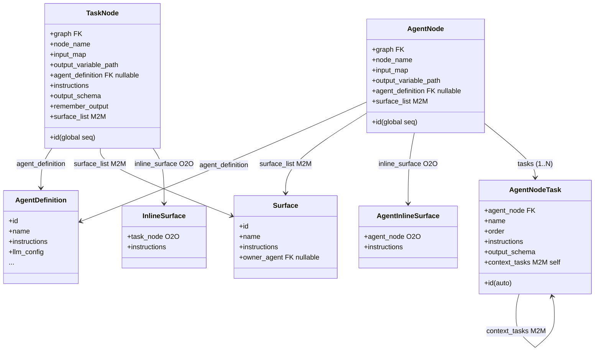

# AgentNode & TaskNode — Graph Node Overview

The two graph node types for agent-powered execution. **TaskNode** runs a
single task. **AgentNode** runs one agent over an ordered list of sub-tasks.
Both replace the deprecated `CrewNode`.

## TaskNode

File: `src/django_app/tables/models/graph_models.py` (class at line 958).

| Field | Type | Notes |
|---|---|---|
| `graph` | FK → `Graph`, `on_delete=CASCADE` | `related_name="task_node_list"`. |
| `agent_definition` | FK → `agents.AgentDefinition`, `on_delete=SET_NULL`, nullable | `related_name="task_nodes"`. The agent that executes this task. Null allowed — runtime surfaces a missing-agent error. |
| `instructions` | `TextField`, blank, default `""` | Task-level prompt text passed to the agent. |
| `output_schema` | `JSONField`, default `dict` | JSON schema the output must conform to. Empty dict = no enforcement. |
| `remember_output` | `BooleanField`, default `False` | If `True`, output is remembered for the run and injected as context into subsequent task nodes in the same session. |
| `surface_list` | M2M → `agents.Surface` | `related_name="task_nodes"`. Zero or more catalog surfaces attached. |

Inherited from `BaseNode` (abstract, line 97):

| Field | Type | Notes |
|---|---|---|
| `node_name` | `CharField(255)`, blank | Auto-generated as `tasknode_{pk}` if left blank on save. |
| `input_map` | `JSONField`, default `dict` | Maps variable names from the flow context into the node's input. |
| `output_variable_path` | `CharField(255)`, nullable | Path in the flow variable store where the node's output is written. |

Inherited from `BaseGraphEntity` → `TimestampMixin`, `MetadataMixin`, `ContentHashMixin`:

| Field | Notes |
|---|---|
| `metadata` | `JSONField` — free-form UI/client data. |
| `content_hash` | From `ContentHashMixin`. |
| `created_at` / `updated_at` | From `TimestampMixin`. |

Inherited from `BaseGlobalNode`:

| Field | Notes |
|---|---|
| `id` | `BigIntegerField`, PK, drawn from `tables_global_node_seq` — shared across ALL node types for cross-table uniqueness. |

## AgentNode

File: same file, class at line 996.

Same shape as `TaskNode` minus `instructions`, `output_schema`,
`remember_output`. Those live on `AgentNodeTask` children instead.

| Field | Type | Notes |
|---|---|---|
| `graph` | FK → `Graph`, `on_delete=CASCADE` | `related_name="agent_node_list"`. |
| `agent_definition` | FK → `agents.AgentDefinition`, `on_delete=SET_NULL`, nullable | `related_name="agent_nodes"`. |
| `surface_list` | M2M → `agents.Surface` | `related_name="agent_nodes"`. |

Plus all `BaseNode` / `BaseGraphEntity` / `BaseGlobalNode` inherited fields
(same as `TaskNode` above).

## AgentNodeTask

File: same file, class at line 1022.

Not a graph node — a child sub-task owned by an `AgentNode`. Executes
sequentially within the parent. Extends `TimestampMixin` only (NOT
`BaseNode`).

| Field | Type | Notes |
|---|---|---|
| `agent_node` | FK → `AgentNode`, `on_delete=CASCADE` | `related_name="tasks"`. |
| `name` | `CharField(255)` | Unique within the parent agent node (deferred constraint `uniq_agentnodetask_node_name`). |
| `order` | `PositiveIntegerField` | Zero-based position. Deferred unique constraint with `agent_node` (`uniq_agentnodetask_node_order`). Tasks execute in ascending order. |
| `instructions` | `TextField`, blank, default `""` | Prompt text for this sub-task. |
| `output_schema` | `JSONField`, default `dict` | JSON schema enforcement, same semantics as `TaskNode`. |
| `context_tasks` | M2M → self, `symmetrical=False` | `related_name="dependent_tasks"`. Earlier sibling tasks whose outputs are injected as context. |
| `created_at` / `updated_at` | From `TimestampMixin`. |

Validation (`clean()`):

- `context_tasks` must belong to the same `agent_node`.
- `context_tasks` must reference tasks with strictly lower `order` values.

Meta ordering: `["order"]`.

## TaskNode vs AgentNode — when to use which

**TaskNode**: single-shot task. One agent, one prompt, one output. Use when a
step is self-contained.

**AgentNode**: multi-step agent. One agent runs an ordered sequence of
sub-tasks. Earlier outputs can feed later tasks via `context_tasks`. Use when
a step requires a pipeline of reasoning within a single agent.

Key differences:

- `TaskNode` has `instructions`, `output_schema`, `remember_output` directly
  on the node.
- `AgentNode` has NO `instructions` / `output_schema` / `remember_output` —
  those live on its `AgentNodeTask` children.
- `TaskNode` dispatches as `RunType.SINGLE_TASK`; `AgentNode` dispatches as
  `RunType.LIST_OF_TASKS`.

## Surface resolution

Three surface sources are merged at runtime:

1. **Agent defaults** — `AgentDefinition.default_surface_list` (filtered by
   `place`).
2. **Node surfaces** — `surface_list` M2M on the node itself.
3. **Inline surface** — optional `InlineSurface` (TaskNode) or
   `AgentInlineSurface` (AgentNode), a one-off ad-hoc surface.

`NodeSurfaceService.build_combined_surface(node)` (in
`src/django_app/agents/services/node_surface_service.py`) serializes node
surfaces + inline surface, then merges them via `SurfaceCombineService.combine`
with DENY-wins precedence. See [Surfaces](../agents/surfaces.md) for combine
rules.

Inline surfaces (`InlineSurface` / `AgentInlineSurface` in
`src/django_app/agents/models/surface_models.py`) have an `instructions` field
plus the same child content models as catalog surfaces (python tools, mcp
tools, storage items, knowledge), but are scoped to a single node and are not
reusable.

## Serializers (bulk save)

Node serializers live in
`src/django_app/tables/serializers/model_serializers/node_serializers/basic_node_serializers.py`.

- `TaskNodeSerializer` — handles `agent_definition`, `surface_list`,
  `instructions`, `output_schema`, `remember_output`, and nested
  `inline_surface` (write-only, delegates to `InlineSurfaceService`).
- `AgentNodeSerializer` — handles `agent_definition`, `surface_list`, nested
  `tasks` list (write-only `AgentNodeTaskWriteSerializer`), and nested
  `inline_surface`. Task upsert: matched by `id`; new tasks use `temp_id` for
  `context_tasks` references. Stale tasks deleted.
- `AgentNodeTaskWriteSerializer` — `id`, `temp_id`, `name`, `order`,
  `instructions`, `output_schema`, `context_task_temp_ids`,
  `context_task_ids`.
- `AgentNodeTaskReadSerializer` — `id`, `name`, `order`, `instructions`,
  `output_schema`, `context_tasks`, timestamps.

These are NOT standalone REST endpoints. They're consumed by the graph bulk
save API, which creates/updates entire flows atomically.

## Runtime dispatch

`TaskNodePayloadService.build_task_node_data` and
`AgentNodePayloadService.build_agent_node_data` (in
`src/django_app/tables/services/`) build the Pydantic payload sent to the crew
service. The crew service's `AgentTaskService._build_agent_spec` (in
`src/crew/services/agent_task_service.py`) converts the definition + combined
surface into an `AgentSpec` + `AgentRequest`, dispatched to the agent service
over Redis Streams (`agent.requests`).

## Related docs

- [Agent Definitions](../agents/agent-definitions.md) — the `AgentDefinition`
  model.
- [Surfaces](../agents/surfaces.md) — surface model, combine precedence,
  runtime resolution.
- [Session Messages](Session_Messages.md) — SSE message format during
  execution.
- [Agent Service](../agents/agent-service.md) — the standalone runner that
  executes the dispatched request.

## Diagram

