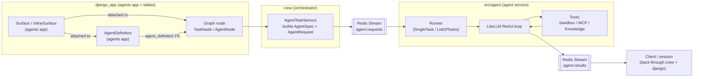

# Agents

This folder documents the **new agent execution path**: org-scoped agent
definitions and reusable capability profiles (Surfaces) defined in the Django
`agents` app, executed by a standalone async **agent service**
(`src/agent/`) over Redis Streams. This is the only agent execution path; the
legacy `tables.Agent` / `tables.Crew` models still exist in the database but
have no API surface and no execution path — do not build on them.

## How the pieces fit

An **`AgentDefinition`** holds an agent's core config: identity, LLM
references (`llm_config` / `fcm_llm_config`), and execution-tuning limits
(`max_iter`, `max_rpm`, `max_execution_time`, `max_tool_calls`, etc). It
carries no capabilities of its own.

**Surfaces** attach capabilities — tool allow/deny, per-file storage access,
knowledge collections with RAG search configs, and prompt instructions — to
an `AgentDefinition` (as a default) or directly to a graph node (`TaskNode` /
`AgentNode`), including one-off inline surfaces. Multiple surfaces on the
same node/agent are merged at runtime with **DENY-wins** precedence into one
combined permission set.

At execution, the django/crew side serializes a definition plus its resolved
surface into an `AgentSpec` wrapped in an `AgentRequest`, and dispatches it
over the Redis Stream `agent.requests` to the **agent service**
(`src/agent/`), which runs a streaming LiteLLM ReAct loop — calling Sandbox,
MCP, and Knowledge tools as needed — and streams results back on the Redis
Stream `agent.results`.

## Docs

| Doc | Description |
|---|---|
| [Surfaces](surfaces.md) | Capability/permission profile model family, combine precedence, runtime resolution |
| [Agent Definitions](agent-definitions.md) | `AgentDefinition` model, graph node linkage, runtime bridge to `AgentSpec` |
| [Agent Service](agent-service.md) | `src/agent/` runner, LLM loop, tools, structured output, result streaming |

## End-to-end pipeline

## Key source locations

- [`src/django_app/agents/`](../../src/django_app/agents/) — `AgentDefinition` and `Surface` model families, services, views
- [`src/django_app/tables/models/graph_models.py`](../../src/django_app/tables/models/graph_models.py) — `TaskNode` / `AgentNode` graph node models
- [`src/crew/services/agent_task_service.py`](../../src/crew/services/agent_task_service.py) — builds `AgentSpec`/`AgentRequest` and dispatches over Redis Streams
- [`src/agent/`](../../src/agent/) — standalone agent runner microservice
- [`src/shared/models/agent_service.py`](../../src/shared/models/agent_service.py) — `AgentRequest`/`AgentSpec` contract shared between django/crew and the agent service
