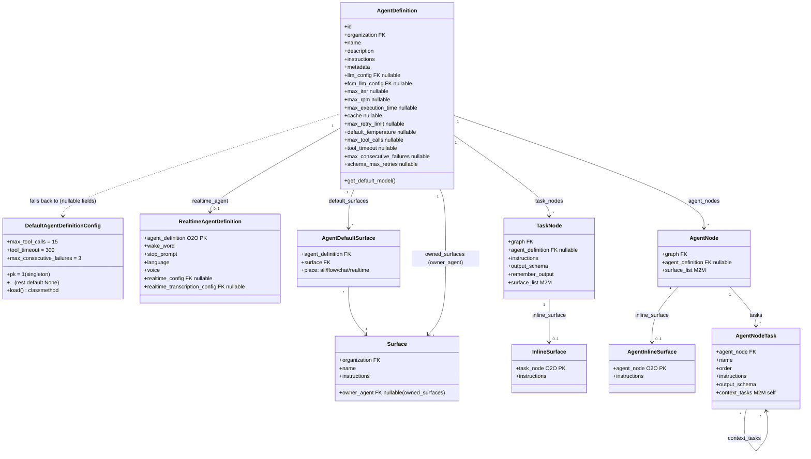

# Agent Definitions

`AgentDefinition` is the new, lean, org-scoped agent config that replaces the
legacy CrewAI `tables.Agent` model for graph execution. It carries identity and
execution-tuning fields only — capabilities (tools, knowledge, storage access)
are **not** columns on the model, they attach through **Surfaces**. Realtime
(voice) configuration is a separate model attached by a one-to-one relation.

This doc covers the model, its Django app, the API surface, how it links into
graph nodes, import/export, and how it reaches the execution runtime.

## 1. The `agents` app

Location: [`src/django_app/agents/`](../../src/django_app/agents/)

```
agents/
├── models/       # agent_models.py (AgentDefinition, DefaultAgentDefinitionConfig,
│                 #   AgentDefaultSurface, SurfacePlace), surface_models.py (Surface,
│                 #   InlineSurface family, AgentInlineSurface family)
├── serializers/  # agent_definition_serializers.py, surface_serializers.py,
│                 #   inline_surface_serializers.py
├── services/     # surface_service.py, node_surface_service.py,
│                 #   surface_combine_service.py, surface_content_service.py,
│                 #   inline_surface_service.py, agent_inline_surface_service.py
├── validators/   # surface_validator.py
├── views/        # agent_definition_views.py, surface_views.py
├── urls.py
└── migrations/
```

Registration:

- App config: [`AgentsConfig`](../../src/django_app/agents/apps.py) (`name = "agents"`).
- Installed in `INSTALLED_APPS` in [`src/django_app/django_app/settings.py`](../../src/django_app/django_app/settings.py) (line 76: `"agents"`).
- URLs mounted in [`src/django_app/django_app/urls.py`](../../src/django_app/django_app/urls.py) (line 106: `path("api/", include("agents.urls"))`).

## 2. `AgentDefinition` model

File: [`src/django_app/agents/models/agent_models.py`](../../src/django_app/agents/models/agent_models.py)

Extends `AbstractDefaultFillableModel` (from [`tables/models/base_models.py`](../../src/django_app/tables/models/base_models.py)), which defines `get_default_fields()` / `fill_with_defaults()` and requires subclasses to implement `get_default_model()`.

### Identity fields

| Field | Type | Notes |
|---|---|---|
| `organization` | FK → `tables.Organization`, `CASCADE` | `related_name="agent_definitions"`. |
| `name` | `CharField(max_length=255)` | Unique per organization via `UniqueConstraint(fields=["organization", "name"], name="unique_agent_definition_name_per_organization")`. Slug-like stable identifier used by flows/UI/code. |
| `description` | `TextField`, blank, default `""` | Human-readable purpose/persona description. |
| `instructions` | `TextField`, blank, default `""` | The agent's prompt — behavior, goals, tone, constraints. |
| `metadata` | `JSONField`, default `dict`, blank | Free-form client/UI data. **Not used by execution.** |

### LLM linkage

| Field | Type | Notes |
|---|---|---|
| `llm_config` | FK → `tables.LLMConfig`, `SET_NULL`, null, default `None` | `related_name="agent_definitions"`. Primary LLM for reasoning and tool selection. |
| `fcm_llm_config` | FK → `tables.LLMConfig`, `SET_NULL`, null, default `None` | `related_name="fcm_agent_definitions"`. Optional dedicated LLM for function/tool-call routing. Falls back to `llm_config` when null. |

### Execution config

All nullable; a `null` value falls back to `DefaultAgentDefinitionConfig` (see §3).

| Field | Type | Meaning |
|---|---|---|
| `max_iter` | `IntegerField`, null | Max reasoning iterations per task. |
| `max_rpm` | `IntegerField`, null | LLM request rate cap (requests/minute). |
| `max_execution_time` | `IntegerField`, null | Wall-clock budget in seconds for a single agent run. Also drives the runtime dispatch timeout (see §9). |
| `cache` | `BooleanField`, null | Enable tool-result caching. |
| `max_retry_limit` | `IntegerField`, null | Max retries on transient LLM/tool failures. |
| `default_temperature` | `FloatField`, null | Sampling temperature when the LLMConfig itself leaves it unset. |
| `max_tool_calls` | `IntegerField`, null | Max tool calls per loop iteration. |
| `tool_timeout` | `IntegerField`, null | Per-tool-call timeout in seconds. |
| `max_consecutive_failures` | `IntegerField`, null | Consecutive failed tool calls before graceful stop. |
| `schema_max_retries` | `IntegerField`, null | Max retries enforcing structured-output schema validation. |

### Surface linkage

| Field | Type | Notes |
|---|---|---|
| `default_surface_list` | `ManyToManyField("Surface", through="AgentDefaultSurface")` | `related_name="default_in_agents"`, blank. Surfaces applied by default to this agent, scoped per `place` (`all` / `flow` / `chat` / `realtime`). |

Reverse relation `owned_surfaces` comes from `Surface.owner_agent` (see §7 in [surface_models.py](../../src/django_app/agents/models/surface_models.py)) — surfaces this agent *owns* (agent-specific, not shared), as opposed to surfaces it merely defaults to.

`get_default_model()` returns `DefaultAgentDefinitionConfig.load()`.

## 3. Defaults singleton — `DefaultAgentDefinitionConfig`

Same file as `AgentDefinition`. A singleton (`pk=1`, `load()` classmethod does `get_or_create(pk=1)`) holding org-wide fallback values for every nullable `AgentDefinition` execution field.

Most fields default to `None` (i.e. "no cap unless set"). Three fields ship non-`None` defaults:

| Field | Default |
|---|---|
| `max_tool_calls` | `15` |
| `tool_timeout` | `300` (seconds) |
| `max_consecutive_failures` | `3` |

All other execution fields (`max_iter`, `max_rpm`, `max_execution_time`, `cache`, `max_retry_limit`, `default_temperature`, `schema_max_retries`) default to `None`.

## 4. No manager LLM

`AgentDefinition` has **no manager-LLM concept**. Manager LLM only exists on the legacy CrewAI path (`tables.Agent` / `tables.Crew`), which remains a separate, parallel model family used by the old `AGENT` / `CREW` node types. Do not conflate the two — `AgentDefinition` is not a superset of `tables.Agent`.

## 5. Realtime config

Realtime (voice) settings live on a **separate** model, not on `AgentDefinition` itself:

`RealtimeAgentDefinition` — [`src/django_app/tables/models/realtime_models.py`](../../src/django_app/tables/models/realtime_models.py)

| Field | Type | Notes |
|---|---|---|
| `agent_definition` | `OneToOneField("agents.AgentDefinition", CASCADE, primary_key=True)` | `related_name="realtime_agent"`. |
| `wake_word` | `CharField(255)`, null/blank | In `save()`, defaults to `agent_definition.name` (falls back to `"agent"`) if left `None`. |
| `stop_prompt` | `CharField(255)`, default `"stop"` | |
| `language` | `CharField(2)`, null/blank | ISO-639-1 code. |
| `voice_recognition_prompt` | `TextField`, null/blank | Guides transcription (e.g. "expect technology terms"). |
| `voice` | `CharField(100)`, default `VoiceChoices.ALLOY` | |
| `realtime_config` | FK → `RealtimeConfig`, `SET_NULL`, null | |
| `realtime_transcription_config` | FK → `RealtimeTranscriptionConfig`, `SET_NULL`, null | |

Note the legacy sibling `RealtimeAgent` (same file) is the equivalent OneToOne wired to the legacy `tables.Agent` instead — same field shape, different owner model.

## 6. Serializers + viewset

File: [`src/django_app/agents/serializers/agent_definition_serializers.py`](../../src/django_app/agents/serializers/agent_definition_serializers.py)

- **`AgentDefinitionReadSerializer`** — all `AgentDefinition` fields, read-only (`read_only_fields = fields`), plus a computed `default_surfaces` field via `SerializerMethodField` → `AgentDefinitionSurfaceService.get_default_surfaces(obj)` (service module: [`agents/services/surface_service.py`](../../src/django_app/agents/services/surface_service.py)).
- **`AgentDefinitionWriteSerializer`** — `ModelSerializer` over the writable fields. `llm_config` / `fcm_llm_config` are optional, nullable `PrimaryKeyRelatedField`s. `default_surfaces` is a nested list write (`AgentDefaultSurfaceWriteSerializer`: `surface` PK + `place` choice). Numeric guards: `max_tool_calls >= 1`, `tool_timeout >= 1`, `max_consecutive_failures >= 1`, `schema_max_retries >= 0`. `create()`/`update()` catch Django `IntegrityError` and re-raise as `AgentDefinitionConflictError` (domain exception, [`agents/exceptions.py`](../../src/django_app/agents/exceptions.py)), then delegate surface persistence to `AgentDefinitionSurfaceService.set_default_surfaces`. `validate()` runs `SurfaceValidator.validate_agent_default_surfaces` when `default_surfaces` and `organization` (from serializer context) are present.
- `AgentDefaultSurfaceReadSerializer` / `AgentDefaultSurfaceWriteSerializer` — the through-row shape (`surface`, `place`).

ViewSet: [`AgentDefinitionViewSet`](../../src/django_app/agents/views/agent_definition_views.py) (`viewsets.ModelViewSet`)

- `queryset` — `select_related("organization", "llm_config", "fcm_llm_config")`, `prefetch_related("default_surfaces__surface", "owned_surfaces")`.
- `filter_backends = [DjangoFilterBackend]`, `filterset_fields = ["llm_config", "fcm_llm_config"]`.
- Organization is hardcoded to `DEFAULT_ORGANIZATION_NAME` (`tables.constants.organization_constants`) via `_get_organization()` — no multi-org selection yet.
- `get_serializer_class()` splits read (`list`/`retrieve`) vs write (everything else).
- `create`/`update`/`partial_update` are overridden, wrapped in `@transaction.atomic`, and each write-then-re-read: validate with the write serializer, save, then re-serialize the instance with `AgentDefinitionReadSerializer` for the response (so responses always include `default_surfaces` and other computed/read-only data).

Endpoint: `/api/agent-definitions/` — registered in [`agents/urls.py`](../../src/django_app/agents/urls.py) via `DefaultRouter` (`basename="agentdefinition"`).

## 7. Graph node linkage

File: [`src/django_app/tables/models/graph_models.py`](../../src/django_app/tables/models/graph_models.py)

- **`TaskNode`** (extends `BaseNode`, line 928) — `graph` FK (`related_name="task_node_list"`); `agent_definition` FK → `agents.AgentDefinition`, `SET_NULL`, null/blank (`related_name="task_nodes"`) — the agent that executes this task; null is allowed, runtime surfaces a missing-agent error in that case. Plus `instructions` (task-level prompt text), `output_schema` (JSONField, empty dict = no schema enforcement), `remember_output` (bool — if true, output is injected as context into later task nodes in the same session run), `surface_list` (M2M → `agents.Surface`, `related_name="task_nodes"`).
- **`AgentNode`** (extends `BaseNode`, line 966) — represents an agent executing an ordered list of sub-tasks with shared surfaces. `graph` FK (`related_name="agent_node_list"`); `agent_definition` FK (same shape as above, `related_name="agent_nodes"`); `surface_list` (M2M → `agents.Surface`, `related_name="agent_nodes"`).
- **`AgentNodeTask`** (extends `TimestampMixin`, line 992) — a child sub-task of an `AgentNode`; **not** a graph node itself, executes sequentially within its parent. Fields: `agent_node` FK (`related_name="tasks"`), `name` (unique within the node), `order` (zero-based position, `Meta.ordering = ["order"]`), `instructions`, `output_schema`, `context_tasks` (self-referential M2M, `symmetrical=False`, `related_name="dependent_tasks"` — earlier sibling tasks whose outputs are injected as context). `clean()` enforces `context_tasks` belong to the same `agent_node` and reference strictly lower `order` values than `self`.

Each node's per-task/per-node ad-hoc surface is a **separate** OneToOne model, not a field on the node itself — see §8's inline surfaces.

This FK/related_name pairing is part of the cross-layer contract described in the repo's `CLAUDE.md`: Django `related_name` ↔ crew `GraphData` field ↔ frontend `GraphDto` field must match exactly (`agent_node_list`, `task_node_list`).

## 8. Import/export

Directory: [`src/django_app/tables/import_export/`](../../src/django_app/tables/import_export/)

- `EntityType.AGENT_DEFINITION = "AgentDefinition"` is distinct from the legacy `EntityType.AGENT = "Agent"` ([`enums.py`](../../src/django_app/tables/import_export/enums.py)).
- Strategy: [`strategies/agent_definition.py`](../../src/django_app/tables/import_export/strategies/agent_definition.py) — `AgentDefinitionStrategy`:
  - `extract_dependencies_from_instance` — deps are `llm_config` + `fcm_llm_config` (dedup'd into `LLM_CONFIG`), and the union of `owned_surfaces` ∪ `default_surface_list` (into `SURFACE`).
  - `create_entity` — remaps FKs via `IDMapper`, forces the target organization to `DEFAULT_ORGANIZATION_NAME`, and dedupes the `name` via `ensure_unique_identifier` before creating. Afterward it assigns `llm_config`/`fcm_llm_config` (`_assign_llm_configs`), reassigns owned surfaces by setting `Surface.owner_agent` (`_assign_owned_surfaces`), and rebuilds `AgentDefaultSurface` rows (`_assign_default_surfaces`).
- Serializer: [`serializers/agent_definition.py`](../../src/django_app/tables/import_export/serializers/agent_definition.py) (`AgentDefinitionImportSerializer`).
- Node handlers: [`strategies/node_handlers.py`](../../src/django_app/tables/import_export/strategies/node_handlers.py):
  - `import_task_node` / `import_agent_node` remap `agent_definition` via the `IDMapper`, reassign `surface_list` (`_assign_node_surface_list`), and rebuild the node's inline surface via `_create_inline_surface` — `InlineSurface` (owner: `task_node`) for `TaskNode`, `AgentInlineSurface` (owner: `agent_node`) for `AgentNode`, both defined in [`agents/models/surface_models.py`](../../src/django_app/agents/models/surface_models.py).
  - `_create_agent_node_tasks` rebuilds each `AgentNodeTask` and rewires `context_tasks` using an old-id→new-instance map built during the same pass.

## 9. Runtime bridge — how a definition reaches execution

1. **Pydantic contract** — `AgentDefinitionData` ([`src/shared/models/graph_nodes.py`](../../src/shared/models/graph_nodes.py), line 133, `model_config = ConfigDict(from_attributes=True)`) mirrors the Django execution-config fields (`max_iter`, `max_rpm`, `max_execution_time`, `cache`, `max_retry_limit`, `default_temperature`, `max_tool_calls`, `tool_timeout`, `max_consecutive_failures`, `schema_max_retries`) plus `llm_config_id`/`fcm_llm_config_id` and resolved `llm`/`fcm_llm` (`LLMData`). `GraphData` carries `task_node_list: list[TaskNodeData]` and `agent_node_list: list[AgentNodeData]` (lines 276–277) — the crew-side halves of the cross-layer contract from §7.
2. **`AgentTaskService._build_agent_spec`** ([`src/crew/services/agent_task_service.py`](../../src/crew/services/agent_task_service.py), line 207) builds an `AgentSpec` from the `AgentDefinitionData`: appends surface instructions to the base `instructions`, maps `llm`/`fcm_llm`/`max_iter`/`schema_max_retries`/`max_rpm`/`max_execution_time`/`cache`/`max_retry_limit`/`default_temperature`/`max_tool_calls`/`tool_timeout`/`max_consecutive_failures`, and attaches `tool_refs` / `collection_refs` / `s3_refs` (unique names / ids resolved from surfaces).
3. **Dispatch** — the built `AgentSpec` is sent to the `src/agent` microservice over Redis Streams: request published to `agent.requests`, result awaited on `agent.results` (`agent.result` payload; non-success `stop_reason` values raise `AgentTaskError`). `max_execution_time` (multiplied by task count, plus a fixed buffer) drives the dispatch timeout (line 137).

## 10. Migrations

New-app migrations live under [`src/django_app/agents/migrations/`](../../src/django_app/agents/migrations/):

- `0001_initial.py` — creates `AgentDefinition` (including `schema_max_retries` and `fcm_llm_config` already present), `DefaultAgentDefinitionConfig`, `Surface`, and the `AgentDefaultSurface` through table.
- `0002_initial.py` — additional agents-app tables (surface tool/knowledge/storage through-models, inline surface models).
- `0003_alter_agentdefaultsurface_place.py` — widens `AgentDefaultSurface.place` and adds the `REALTIME` value to `SurfacePlace`.

As with all model changes, run migrations via `make django-makemigrations` / `make django-migrate` from the repo root, never `manage.py` directly.

## 11. Relationship diagram


