# Surfaces

## Overview

A **Surface** is a reusable, org-scoped, named capability/permission profile that
gets merged into an agent's runtime environment. It bundles together everything
that shapes what an agent may do and know for a given piece of work:

- tool access (allow/deny for Python and MCP tools)
- per-file storage access (list/view/edit/delete)
- knowledge collections plus their RAG search configuration
- free-form prompt instructions appended to the agent's prompt

Surfaces let the same permission/capability profile be defined once and reused
across many agents, tasks, and graph nodes, instead of re-declaring tool/storage/
knowledge access on every node.

The whole concept lives in the `agents` Django app:
[src/django_app/agents/](../../src/django_app/agents/), specifically:

- Models: [surface_models.py](../../src/django_app/agents/models/surface_models.py), [agent_models.py](../../src/django_app/agents/models/agent_models.py)
- Serializers: [surface_serializers.py](../../src/django_app/agents/serializers/surface_serializers.py), [inline_surface_serializers.py](../../src/django_app/agents/serializers/inline_surface_serializers.py)
- Services: [surface_service.py](../../src/django_app/agents/services/surface_service.py), [surface_combine_service.py](../../src/django_app/agents/services/surface_combine_service.py), [surface_content_service.py](../../src/django_app/agents/services/surface_content_service.py), [node_surface_service.py](../../src/django_app/agents/services/node_surface_service.py)
- Validators: [surface_validator.py](../../src/django_app/agents/validators/surface_validator.py)
- Views: [surface_views.py](../../src/django_app/agents/views/surface_views.py)
- Exceptions: [exceptions.py](../../src/django_app/agents/exceptions.py)

## Model families

There are **three parallel model families**, all sharing the same abstract base
classes so their content structure is identical, only the parent relationship
differs:

| Family | Root model | Parent relationship | Purpose |
|---|---|---|---|
| Catalog | `Surface` | belongs to `Organization`, optionally owned by an `AgentDefinition` | reusable, named, listed via the REST API |
| Task-inline | `InlineSurface` | `OneToOneField` to `TaskNode` | ad-hoc, one-off surface scoped to a single task node |
| Agent-inline | `AgentInlineSurface` | `OneToOneField` to `AgentNode` | ad-hoc, one-off surface scoped to a single agent node |

The shared abstract bases in
[surface_models.py](../../src/django_app/agents/models/surface_models.py) are:
`BaseSurfacePythonTool`, `BaseSurfaceMcpTool`, `BaseSurfaceStorageItem`,
`BaseSurfaceKnowledge`, plus the three search-config bases
(`BaseSurfaceNaiveSearchConfig`, `BaseSurfaceGraphBasicSearchConfig`,
`BaseSurfaceGraphLocalSearchConfig`). Each family (`Surface*`, `InlineSurface*`,
`AgentInlineSurface*`) subclasses these bases and adds its own parent FK/O2O.

### `Surface` fields

| Field | Type | Notes |
|---|---|---|
| `organization` | FK → `tables.Organization`, `CASCADE` | owning organization |
| `name` | `CharField(max_length=255)` | unique per organization via `UniqueConstraint("organization", "name")` named `uniq_surface_org_name` |
| `instructions` | `TextField`, blank/default `""` | appended to the agent prompt when the surface is active |
| `owner_agent` | FK → `AgentDefinition`, `CASCADE`, nullable | `None` = shared (any agent may use it); set = agent-specific (only that agent) |
| `created_at` / `updated_at` | via `TimestampMixin` | standard timestamps |

### `InlineSurface` / `AgentInlineSurface` fields

Both are much smaller — no `organization`, `name`, or `owner_agent`, since they
are not catalog entries:

| Field | Type | Notes |
|---|---|---|
| `task_node` (`InlineSurface`) / `agent_node` (`AgentInlineSurface`) | `OneToOneField` → `TaskNode` / `AgentNode`, `CASCADE` | the node that owns this ad-hoc surface; deleted with the node |
| `instructions` | `TextField`, blank/default `""` | same semantics as `Surface.instructions` |

### Ownership semantics

`owner_agent` on `Surface` decides who may attach it:

- `owner_agent = None` → **shared** — any agent, any task/agent node may attach it.
- `owner_agent = <agent>` → **agent-specific** — only that same `AgentDefinition`
  (and nodes whose `agent_definition` matches it) may attach it. Enforced by
  `SurfaceValidator.validate_agent_default_surfaces` /
  `validate_task_node_surfaces` / `validate_agent_node_surfaces` (see
  [surface_validator.py](../../src/django_app/agents/validators/surface_validator.py)).

## Enums

Defined at the top of
[surface_models.py](../../src/django_app/agents/models/surface_models.py):

```python
class ToolMode(models.TextChoices):
    ALLOW = "allow"
    DENY = "deny"

class StorageAccess(models.TextChoices):
    ALLOW = "allow"   # explicitly allowed
    UNSET = "unset"   # default — neither granted nor forbidden
    DENY = "deny"     # explicitly forbidden — hard deny, overrides any grant
```

- **`ToolMode`** is effectively tri-state through row *presence*: a tool with no
  `SurfacePythonTool`/`SurfaceMcpTool` row for a given surface is simply "not
  mentioned" by that surface — neither allowed nor denied by it.
- **`StorageAccess`** is a true tri-state per flag. `UNSET` is the default and
  means "this surface doesn't grant or forbid it". `DENY` is a hard deny that
  wins over any `ALLOW` when surfaces are combined (see [Combine precedence](#combine-precedence)).

## Child content models

All three families attach the same shape of content. Fields shown below are for
the catalog (`Surface*`) family; the Inline/AgentInline families mirror this
exactly, with the parent FK renamed to `inline_surface` / `agent_inline_surface`
respectively, and unique constraints renamed accordingly (e.g.
`uniq_inline_surface_python_tool`, `uniq_agent_inline_surface_knowledge`).

| Model | Parent FK (catalog) | Other fields | Unique constraint |
|---|---|---|---|
| `SurfacePythonTool` | `surface` | `python_tool` (FK → `tables.PythonCodeTool`), `mode` (`ToolMode`) | `(surface, python_tool)` — `uniq_surface_python_tool` |
| `SurfaceMcpTool` | `surface` | `mcp_tool` (FK → `tables.McpTool`), `mode` (`ToolMode`) | `(surface, mcp_tool)` — `uniq_surface_mcp_tool` |
| `SurfaceStorageItem` | `surface` | `storage_file` (FK → `tables.StorageFile`), `can_list`, `can_view`, `can_edit`, `can_delete` (each `StorageAccess`, default `UNSET`) | `(surface, storage_file)` — `uniq_surface_storage_item` |
| `SurfaceKnowledge` | `surface` | `collection` (FK → `tables.SourceCollection`) | `(surface, collection)` — `uniq_surface_knowledge` |

`SurfaceKnowledge` optionally has up to three `OneToOneField` search-config rows
attached to it (at most one of each is expected to be set per collection, chosen
by the collection's configured RAG type):

| Model | Fields |
|---|---|
| `SurfaceNaiveSearchConfig` | `search_limit` (`PositiveIntegerField`, default 3), `similarity_threshold` (`DecimalField(3,2)`, default 0.20) |
| `SurfaceGraphBasicSearchConfig` | `prompt` (nullable `TextField`), `k` (`IntegerField`, default 10), `max_context_tokens` (`IntegerField`, default 12000) |
| `SurfaceGraphLocalSearchConfig` | `prompt` (nullable `TextField`), `text_unit_prop` (`FloatField`, default 0.5), `community_prop` (`FloatField`, default 0.15), `conversation_history_max_turns` (`IntegerField`, default 5), `top_k_entities` (`IntegerField`, default 10), `top_k_relationships` (`IntegerField`, default 10), `max_context_tokens` (`IntegerField`, default 12000) |

## Attachment to agents

`AgentDefaultSurface` is the through table wiring `Surface` catalog entries to
`AgentDefinition` (`src/django_app/agents/models/agent_models.py`):

| Field | Type | Notes |
|---|---|---|
| `agent_definition` | FK → `AgentDefinition`, `CASCADE` | the agent this default applies to |
| `surface` | FK → `Surface`, `CASCADE` | the surface being assigned |
| `place` | `CharField`, choices `SurfacePlace` | context this default applies in |

`SurfacePlace` choices: `ALL`, `FLOW`, `CHAT`, `REALTIME`.
Unique constraint `(agent_definition, surface, place)` — `uniq_agent_default_surface`.

`AgentDefinition.default_surface_list` is the `ManyToManyField` to `Surface`
through `AgentDefaultSurface` (`related_name="default_in_agents"`).

### The implicit-ALL rule

`AgentDefinitionSurfaceService.get_default_surfaces` in
[surface_service.py](../../src/django_app/agents/services/surface_service.py)
implements this precedence:

1. Every explicit `AgentDefaultSurface` row for the agent is included as-is
   (with its own `place`).
2. Every surface the agent **owns** (`surface.owner_agent == agent`) that does
   **not** already have an explicit row is also included, implicitly, with
   `place = SurfacePlace.ALL`.
3. Shared surfaces (`owner_agent = None`) are **never** added implicitly — they
   only apply if an explicit `AgentDefaultSurface` row was created for them.

In short: *"an agent's own surfaces are always active everywhere by default,
unless you explicitly say otherwise; shared surfaces are opt-in only."*

## Attachment to graph nodes

`TaskNode` and `AgentNode`
(`src/django_app/tables/models/graph_models.py`) each carry:

- `surface_list` — `ManyToManyField` to `Surface`, blank, `related_name`
  `task_nodes` / `agent_nodes` respectively. Zero or more catalog surfaces
  directly attached to that node.
- an optional inline surface reached via reverse `OneToOneField` accessor
  `node.inline_surface` — `InlineSurface` for `TaskNode`, `AgentInlineSurface`
  for `AgentNode`.

Both are combined at runtime (see [Runtime resolution](#runtime-resolution)).

## REST API

`SurfaceViewSet` in
[surface_views.py](../../src/django_app/agents/views/surface_views.py) exposes:

| Endpoint | Method | Behavior |
|---|---|---|
| `/api/surfaces/` | `GET` | list, `SurfaceReadSerializer` |
| `/api/surfaces/` | `POST` | create, atomic, returns `SurfaceReadSerializer` |
| `/api/surfaces/{id}/` | `GET` | retrieve, `SurfaceReadSerializer` |
| `/api/surfaces/{id}/` | `PUT` | full update, atomic, returns `SurfaceReadSerializer` |
| `/api/surfaces/{id}/` | `PATCH` | partial update via `SurfacePatchWriteSerializer`, atomic, returns `SurfaceReadSerializer` |
| `/api/surfaces/{id}/` | `DELETE` | standard `ModelViewSet` delete |
| `/api/surfaces/combine/` | `POST` | merges N surfaces (by id) into one combined payload |

Organization scoping is hardcoded: `get_queryset()` always filters
`organization=Organization.objects.get(name=DEFAULT_ORGANIZATION_NAME)` — there
is currently no multi-tenant org selection at this layer.

`create`/`update`/`partial_update` are wrapped in `@transaction.atomic`, always
build a write serializer, save it, `refresh_from_db()`, then re-serialize the
instance through `SurfaceReadSerializer` for the response — write and read
shapes are never conflated.

Serializer split
([surface_serializers.py](../../src/django_app/agents/serializers/surface_serializers.py)):

- `SurfaceReadSerializer` — `ModelSerializer`, nests `python_tools`,
  `mcp_tools`, `storage_items`, `knowledge` (each with their own nested
  search-config read serializers). All fields read-only.
- `SurfaceWriteSerializer` — plain `Serializer` (not model-bound); validates via
  `SurfaceService.validate_surface_data` + `SurfaceValidator.*`; `create`/
  `update` delegate to `SurfaceService`.
- `SurfacePatchWriteSerializer` — subclasses `SurfaceWriteSerializer`, makes all
  fields optional for PATCH semantics.
- `SurfaceCombineRequestSerializer` — validates `surface_ids` (no duplicates,
  restricted to the request's organization via a dynamically-scoped queryset).

## Write path

1. **Validate** — `SurfaceService.validate_surface_data` builds a candidate
   `Surface` instance and calls `full_clean()`; a `django.core.exceptions.ValidationError`
   (including the duplicate-name `IntegrityError` Django converts during
   `full_clean`) is re-raised as `SurfaceValidationError` (400). Then
   `SurfaceValidator` checks, per content type:
   - `validate_python_tools` / `validate_mcp_tools` — no duplicate tool ids.
   - `validate_storage_items` — no duplicate `storage_file` ids; every
     `storage_file` must belong to the request's organization.
   - `validate_knowledge` — no duplicate `collection` ids; a search config
     (naive/graph-basic/graph-local) may only be attached if the collection has
     a matching `rag_type` row in `BaseRagType`.

   All validation failures raise `SurfaceValidationError` → DRF maps it to a
   400 response.

2. **Persist** — `SurfaceContentService`
   ([surface_content_service.py](../../src/django_app/agents/services/surface_content_service.py))
   does a **delete-all-and-recreate** of every content type on each write. It is
   parameterized over the three families via a `SurfaceContentModels` dataclass
   (`CATALOG_SURFACE_CONTENT`, `INLINE_SURFACE_CONTENT`,
   `AGENT_INLINE_SURFACE_CONTENT`) so the same replace logic serves `Surface`,
   `InlineSurface`, and `AgentInlineSurface` without duplication.

## Combine precedence

`SurfaceCombineService.combine`
([surface_combine_service.py](../../src/django_app/agents/services/surface_combine_service.py))
takes a list of surface dicts (as produced by the read serializers) and merges
them into one combined dict:

- **`instructions`** — every non-blank surface's `instructions` concatenated
  with `"\n\n"`, in surface order.
- **`python_tools` / `mcp_tools`** — merged per tool id; `DENY` beats `ALLOW`
  wherever the same tool id appears on multiple surfaces
  (`_TOOL_MODE_PRECEDENCE = {DENY: 2, ALLOW: 1}`).
- **`storage_items`** — merged per `storage_file` id, independently *per flag*
  (`can_list`, `can_view`, `can_edit`, `can_delete`); precedence
  `DENY(3) > ALLOW(2) > UNSET(1)` — a hard deny on any surface wins for that
  flag regardless of what other surfaces say.
- **`knowledge`** — deduplicated by `collection` id. If the same collection
  appears on two surfaces with **different** RAG search configs, combining
  raises `SurfaceValidationError` — conflicting configs for the same collection
  are not resolvable automatically and must be fixed at the source.

## Runtime resolution

Two paths consume combined surfaces, both ultimately built on
`SurfaceCombineService.combine`:

### Flow / chat execution (per graph node)

`NodeSurfaceService.build_combined_surface(node)`
([node_surface_service.py](../../src/django_app/agents/services/node_surface_service.py))
gathers `node.surface_list.all()` plus the node's inline surface (if any —
`AgentInlineSurface` or `InlineSurface`, detected via `isinstance`), serializes
each with the matching read serializer, and combines them, returning a plain
`dict`.

`TaskNodePayloadService.build_task_node_data` and
`AgentNodePayloadService.build_agent_node_data`
(`src/django_app/tables/services/task_node_payload_service.py`,
`agent_node_payload_service.py`) wrap that dict into the shared Pydantic
`CombinedSurfaceData` model
(`src/shared/models/surfaces.py`) and pass it to the shared
`BaseNodePayloadService`
(`src/django_app/tables/services/base_node_payload_service.py`), which derives
the concrete runtime resource pools:

- `_build_tool_pool` — only `python_tools`/`mcp_tools` entries with
  `mode == "allow"` are hydrated into `BaseToolData`.
- `_build_s3_pool` — only `storage_items` entries where **any** of
  `can_list`/`can_view`/`can_edit`/`can_delete` is `"allow"` are hydrated into
  `S3FileSpec` (the per-flag values ride along in `metadata.flags` for the
  consuming service to check).
- `_build_collection_pool` — each `knowledge` entry is resolved against the
  latest completed `NaiveRag`/`GraphRag` for its collection and turned into a
  `CollectionSpec` with one `SearchConfigEntry` per configured search type.

### Realtime (voice) sessions

`RealtimeSurfaceService.resolve(agent_definition)`
(`src/django_app/tables/services/realtime_surface_service.py`) does **not** use
`NodeSurfaceService` — there's no node in a realtime session, only an
`AgentDefinition`. It builds the surface set directly from
`AgentDefaultSurface` rows filtered to `place ∈ {ALL, REALTIME}`, plus the same
implicit-owned-surfaces fallback as
`AgentDefinitionSurfaceService.get_default_surfaces`, then combines them.
MCP tools are logged and skipped (`_warn_on_mcp_tools`) — there is no realtime
MCP tool executor. Only the first knowledge collection is used if more than one
is present (a warning is logged).

## Lifecycle

- **Catalog `Surface`** is org-scoped and reusable across many agents/nodes.
- `owner_agent` `CASCADE` — deleting an `AgentDefinition` deletes every surface
  it owns (and, transitively, all their content rows).
- **Inline surfaces** (`InlineSurface`, `AgentInlineSurface`) are `OneToOneField`
  to their node with `CASCADE` — deleting the node deletes its inline surface
  and all its content rows.
- All content rows (`*PythonTool`, `*McpTool`, `*StorageItem`, `*Knowledge`, and
  the three search-config O2Os) `CASCADE` from their parent surface.
- **Content editing is always a full replacement.** There is no incremental
  add/remove of individual tool/storage/knowledge rows through the API —
  `SurfaceContentService` deletes all existing rows for a content type and
  recreates them from the submitted payload on every create/update.

## Diagram

```mermaid
erDiagram
    Organization ||--o{ Surface : "owns"
    AgentDefinition ||--o{ Surface : "owner_agent (nullable)"
    AgentDefinition ||--o{ AgentDefaultSurface : "has defaults"
    Surface ||--o{ AgentDefaultSurface : "assigned as default"
    AgentDefinition }o--o{ Surface : "default_surface_list (through AgentDefaultSurface)"

    Surface ||--o{ SurfacePythonTool : "python_tools"
    Surface ||--o{ SurfaceMcpTool : "mcp_tools"
    Surface ||--o{ SurfaceStorageItem : "storage_items"
    Surface ||--o{ SurfaceKnowledge : "knowledge"
    SurfaceKnowledge ||--o| SurfaceNaiveSearchConfig : "naive_search_config"
    SurfaceKnowledge ||--o| SurfaceGraphBasicSearchConfig : "graph_basic_search_config"
    SurfaceKnowledge ||--o| SurfaceGraphLocalSearchConfig : "graph_local_search_config"

    TaskNode }o--o{ Surface : "surface_list"
    TaskNode ||--o| InlineSurface : "inline_surface"
    InlineSurface ||--o{ InlineSurfacePythonTool : "python_tools"
    InlineSurface ||--o{ InlineSurfaceMcpTool : "mcp_tools"
    InlineSurface ||--o{ InlineSurfaceStorageItem : "storage_items"
    InlineSurface ||--o{ InlineSurfaceKnowledge : "knowledge"

    AgentNode }o--o{ Surface : "surface_list"
    AgentNode ||--o| AgentInlineSurface : "inline_surface"
    AgentInlineSurface ||--o{ AgentInlineSurfacePythonTool : "python_tools"
    AgentInlineSurface ||--o{ AgentInlineSurfaceMcpTool : "mcp_tools"
    AgentInlineSurface ||--o{ AgentInlineSurfaceStorageItem : "storage_items"
    AgentInlineSurface ||--o{ AgentInlineSurfaceKnowledge : "knowledge"
```


