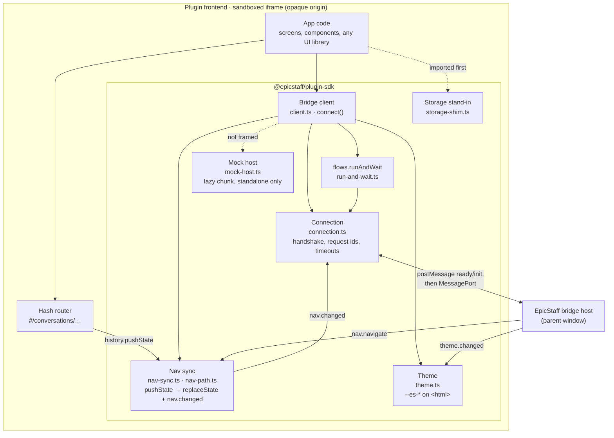

# Plugin author tooling — SDK, CLI, dev mode

How a plugin author builds a plugin **app** (bridge v2) and iterates on it. This is the plugin side of the picture in
[[plugins-architecture]]; the protocol it speaks is [[plugin-bridge-v2]]; what goes into the file is
[[plugin-package-format]]. The hands-on author guide (API reference, Angular and Vite build settings) is
`plugin-sdk/README.md`.

## What an author gets

| Tool | Where | What it does |
|---|---|---|
| **SDK** `@epicstaff/plugin-sdk` | `plugin-sdk/src/` | `connect()` → a typed bridge client: handshake, every v2 method, `flows.runAndWait`, events, nav sync, theme |
| **Storage stand-in** | `plugin-sdk/src/storage-shim.ts` (`@epicstaff/plugin-sdk/storage-shim`) | In-memory `localStorage` / `sessionStorage` / `document.cookie` where the sandbox throws, so libraries don't crash |
| **Mock host** | `plugin-sdk/src/mock-host.ts` (`@epicstaff/plugin-sdk/mock-host`) | Runs the app outside EpicStaff (`ng serve`, Vite) with fake flows and tables that validate like the real host |
| **CLI** `epicstaff-plugin` | `plugin-sdk/bin/`, `plugin-sdk/cli/` | `validate` (mirrors the server's rules, plus an HTML lint) and `pack` (reproducible zip) |
| **Dev mode** | EpicStaff: Settings → Plugins → *Dev mode* | An installed plugin's app loads from `http://localhost:<port>/` for the admin who set it, with real data and the real bridge |
| **Sample** | `plugin-samples/chat-admin/` | `plugin/` (manifest + generated `resources.json`) and `app/` (Angular 22 app using all of the above) |

The SDK is not published to npm; apps depend on it by path (`file:../../../plugin-sdk`).

## C4 level 3 — Components: inside the plugin frontend container

| Component | Responsibility |
|---|---|
| `client.ts` | `connect(options)` → `EpicStaffBridge`: `context`, `call`, `on`, `flows.*`, `sessions.*`, `kv.*`, `nav`, `theme`, `close`; one bridge per page |
| `connection.ts` | Posts `{v:2, kind:"ready"}`, takes the `MessagePort` from `init`, matches responses to request ids, applies timeouts, closes cleanly |
| `run-and-wait.ts` | `flows.run` → `sessions.subscribe` → resolves with the End node's output, rejects with a reason (`failed`, `no_output`, `disconnected`, `timeout`, `aborted`) |
| `nav-sync.ts`, `nav-path.ts` | Patches `history.pushState` / `replaceState` so the frame never adds history entries; reports paths with `nav.changed`; replays `nav.navigate` as `popstate` / `hashchange` |
| `theme.ts` | Sets the `--es-…` tokens, `data-es-theme` and `color-scheme` on `<html>`; follows `theme.changed` |
| `storage-shim.ts` | In-memory storage where access throws; `force` to replace everywhere |
| `mock-host.ts` | A fake host over a `MessageChannel`: flows as functions, tables as arrays, the same validation and limits |
| `errors.ts`, `report-error.ts`, `protocol.ts` | `BridgeCallError` / `FlowRunError`; error reporting for callbacks; v2 protocol types |

## The author loop

1. **Standalone:** outside a frame, `connect()` falls back to the mock host, so the app runs in a normal dev server
   with fake flows and tables.
2. **Package:** build the app, then `epicstaff-plugin pack <plugin-dir> --ui <build-dir> --out plugin.zip` validates
   and writes the zip; `validate` alone reports every problem at once.
3. **Install once**, like any plugin.
4. **Dev mode:** on an instance started with `PLUGINS_DEV_MODE=True`, an admin with `plugins:update` sets the plugin's
   dev URL to the dev server (`http://localhost:4300/`). Opening the plugin now loads the app from that server inside
   the same sandboxed frame, with a DEV banner, the real bridge and real data; each live reload re-handshakes. Only
   that admin sees it ([[plugins-rules]] D1–D4).

## Building a framework app for the sandbox

What works and what does not inside the frame is the table in [[plugin-package-format]] → "Rules for plugin
frontends". The settings that matter most:

- **Hash routing** (`withHashLocation()` in Angular; a hash router in Vite apps): an opaque-origin page cannot change its
  path, and the host owns history.
- **No `<base href>`**, no inline scripts: relative URLs already resolve inside the plugin's folder; Angular's critical
  CSS inlining and font inlining are turned off (`optimization.styles.inlineCritical: false`, `fonts: false`).
- **Bundle fonts** (`@fontsource/*` or your own `.woff2`); no CDNs.
- **Import the storage stand-in first** (Angular: list it under `polyfills`).
- **Call `connect()` before the router's first navigation** (Angular: `provideAppInitializer`), so nav sync is in place.
- **Load the mock host lazily**, so production builds never download it.
- **Dev server** with `Access-Control-Allow-Origin: *` on its responses (the frame's origin is `null`).

## The Chat Admin sample

| Part | Where | What |
|---|---|---|
| Manifest | `plugin-samples/chat-admin/plugin/plugin.json` | `bridge: 2`, id `chat-admin`, slot `OPENAI_API_KEY` bound to the LLM config, access `chat` (flow: run, sessions.read, sessions.stop) + `conversations` (key_value_table: read) |
| Resources | `plugin-samples/chat-admin/plugin/resources.json` | Generated by `plugin_export_resources --sample chat-admin`; a test fails when it drifts |
| Flow | inside `resources.json` | Start `{conversation_id, question}` → key-value read (transcript) → Python *Format history* → Task *Answer* → Python *Append turn* (builds the conversation record, ≤ 200 KB) → key-value write → End `{answer, conversation_id}` |
| App | `plugin-samples/chat-admin/app/` | Angular 22, zoneless, hash routing; screens Chat, Conversations (search, sort, paging in the query string), Conversation (transcript), About; bundled Inter font; dev server on port 4300 |
| Python code | `src/django_app/plugins/samples/chat_admin_code/` | The two Python nodes, tested the way the sandbox wraps them |

The app sends only `{conversation_id, question}`; the flow keeps the transcript in the table, which the app then lists
and reads with `kv.list` / `kv.get`.

## Related

- [[plugins-architecture]] — [Plugins — architecture](plugins-architecture.md) (the host side)
- [[plugin-bridge-v2]] — [Plugin bridge v2](plugin-bridge-v2.md)
- [[plugin-package-format]] — [Plugin package format](plugin-package-format.md)
- [[plugins-rules]] — [Plugins — rules](plugins-rules.md)
- [[plugins-prd]] — [Plugins — product requirements](plugins-prd.md)
- [[plugins-glossary]] — [Plugins glossary](plugins-glossary.md)
- [[plugins-code-map]] — [Plugins code map](code-map.md)
