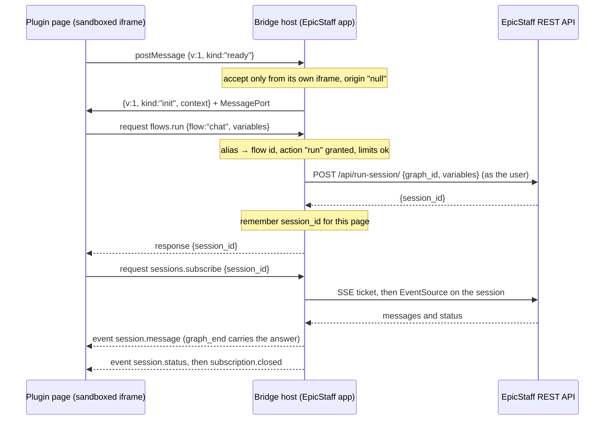

# Plugin bridge v1

How a plugin page (sandboxed iframe) talks to EpicStaff. The page is **untrusted**; the EpicStaff app is the **host**.
The page never holds a token and cannot reach the network, so every action goes through this bridge: the host checks it
against the plugin's access list and then calls the REST API **as the logged-in user** ([[plugins-rules]] S2–S5).

Code: `frontend/src/app/features/plugins/bridge/` — `plugin-bridge-host.service.ts` (host), `bridge-protocol.ts`
(envelope, error codes, limits), `access-policy.ts`, `plugin-session-stream.ts`, `v1/bridge-v1.methods.ts` (method
table). Page side: the sample's `src/django_app/plugins/samples/chat-bot/ui/bridge-client.js`.

## Handshake

1. The page posts `{v: 1, kind: "ready"}` to `window.parent`.
2. The host accepts it **only** if `event.source` is its own iframe's window and `event.origin` is `"null"` (the
   sandbox's opaque origin). A wrong `v` gets a `kind: "error"` reply and no channel.
3. The host creates a `MessageChannel` and sends `{v: 1, kind: "init", context}` with one port. `context` holds the plugin
   (`id`, `version`, `name`) and its access list as aliases and actions (no database ids).
4. From then on, **all traffic uses the port**. A second `ready` is ignored.

## Envelope

Every message carries `v` (must equal the plugin's bridge version) and `kind`.

| Kind | Direction | Shape |
|---|---|---|
| `request` | page → host | `{v, kind, id, method, params}` — `id`: string ≤ 64 chars or a safe integer |
| `response` | host → page | `{v, kind, id, ok: true, result}` or `{v, kind, id, ok: false, error: {code, message}}` |
| `event` | host → page | `{v, kind, topic, subscription, data}` |

Error codes: `bad_request`, `forbidden`, `not_found`, `rate_limited`, `unsupported`, `internal`.

## Methods (v1)

| Method | Needs action | What the host does |
|---|---|---|
| `bridge.hello` | — | returns `{bridge_version, plugin, access, methods}` |
| `flows.run {flow, variables?}` | `run` on the alias | `POST /api/run-session/ {graph_id, variables}` → `{session_id}`; **remembers the id for this page** |
| `sessions.get {session_id}` | `sessions.read` | only ids this page started → `GET /api/sessions/{id}/` → `{status, variables, flow}` |
| `sessions.subscribe {session_id}` | `sessions.read` | only ids this page started → SSE stream relayed as events → `{subscription}` |
| `sessions.unsubscribe {subscription}` | — | closes the stream |
| `sessions.stop {session_id}` | `sessions.stop` | only ids this page started → `POST /api/sessions/{id}/stop/` |

Events on a subscription: `session.message` (`{message_type, name, created_at, message_data}`), `session.status`, and
`subscription.closed` (`{reason: "ended" | "error"}`). The stream closes **3 s after a final status**, because the final
answer (`graph_end`) and the final status travel on different paths and can arrive in either order.

## Access policy

- The page names flows by **alias** only (`"chat"`). The host resolves aliases from the UI-session response; an alias
  that is unknown, not granted the action, or whose flow was deleted is `forbidden`.
- **Page-scoped sessions:** session ids are accepted only if a `flows.run` from this same open page returned them.
  Anything else answers `not_found` **without any request** — a plugin cannot read other users' runs of its flow.
- The API call itself still enforces the user's own permissions, so the result is user ∩ access list.

## Limits (per open page)

| Limit | Value | Error |
|---|---|---|
| Request size (UTF-8 JSON) | 64 KB | `bad_request` (retrying cannot help) |
| Requests waiting for an answer | 10 | `rate_limited` |
| Open subscriptions | 4 | `rate_limited` |
| `flows.run` calls | 20 per 60 s | `rate_limited` |

Bridge calls are flagged so a 403 does not trigger EpicStaff's "reload on forbidden" behaviour.

## Teardown

The host closes the port, all streams and the iframe when: the page **navigates** (a second iframe `load`), the active
**organization changes**, or the host page is destroyed. This is **cleanup, not a security boundary**: some ways of
sending data out never fire `load`. Assume anything the bridge returns may reach the plugin's author ([[plugins-rules]] S8).

## Versioning

- `BRIDGE_TABLES = {1: BRIDGE_V1_METHODS, 2: BRIDGE_V2_METHODS}` in `bridge-tables.ts`; the host dispatches by the
  plugin's `bridge` version (from its manifest, see [[plugin-package-format]]). v2 — for plugin apps — reuses every v1
  handler and adds `kv.*`, `nav.*` and `theme.changed` ([[plugin-bridge-v2]]).
- **v1 is a frozen public contract**: new behaviour means bridge v2; v1 semantics never change, so pages built for v1 keep
  working after EpicStaff upgrades ([[plugins-rules]] U3). If an underlying REST endpoint changes, the v1 handler adapts.
- `bridge-v1.contract.spec.ts` pins method names, params, results, error codes, the envelope, and the exact HTTP call each
  method makes. The backend accepts `SUPPORTED_BRIDGE_VERSIONS = {1, 2}` (`src/django_app/plugins/manifest.py`).

## Round trip

## Related

- [[plugin-bridge-v2]] — [Plugin bridge v2](plugin-bridge-v2.md) (what plugin apps add on top of v1)
- [[plugins-prd]] — [Plugins — product requirements](plugins-prd.md)
- [[plugins-rules]] — [Plugins — rules](plugins-rules.md)
- [[plugins-architecture]] — [Plugins — architecture](plugins-architecture.md)
- [[plugin-package-format]] — [Plugin package format](plugin-package-format.md)
- [[plugins-api-contract]] — [Plugins API contract](api-contract.md) (the `ui-session` response feeds the access policy)
- [[plugins-glossary]] — [Plugins glossary](plugins-glossary.md)
- [[plugins-code-map]] — [Plugins code map](code-map.md)
