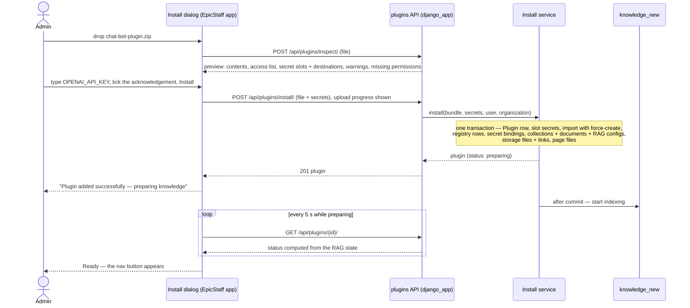

# Plugin package format (`format_version: 1`)

The contract between a **plugin author** and EpicStaff: what goes into the plugin file, what EpicStaff checks, and what
happens when it is installed. Validation lives in `src/django_app/plugins/manifest.py` and
`src/django_app/plugins/services/bundle_reader.py`. Architecture context: [[plugins-architecture]].

## Layout

A plugin file is a `.zip`. At its root (or inside one wrapping folder) only these entries are allowed:

```
chat-bot-plugin.zip
├── plugin.json        manifest — identity, secret slots, knowledge, files, access list, UI entry
├── resources.json     an ordinary EpicStaff Flow export (import format v3)
├── knowledge/         documents that become knowledge collections
├── files/             files placed in EpicStaff storage
└── ui/                the plugin page: .html .js .css .svg .png .json
```

`__MACOSX/` and `.DS_Store` are ignored. Limits: zip ≤ **20 MB**, ≤ **200** entries, ≤ **50 MB** unpacked.

## `resources.json` — reuse, not reinvention

Everything EpicStaff's import already understands stays in `resources.json`, unchanged: the flow and its nodes, agent
definitions, surfaces with their tools, Python and MCP tools, LLM and embedding configs (and their catalog models). Its
`main_entity` must be `"Flow"`. Easiest way to author it: build the flow on a dev stack and export it, or use the helper
command `plugin_export_resources` (`src/django_app/plugins/management/commands/plugin_export_resources.py`).

Inside `plugin.json`, a **`ref`** is the `id` an entity has *inside* `resources.json`. After import, EpicStaff maps refs to
the real database ids.

## `plugin.json` — what import cannot express

| Field | Meaning | Rules |
|---|---|---|
| `format_version` | Version of this file format | must be `1` |
| `bridge` | Bridge version the page is built for ([[plugin-bridge-v1]]) | must be `1` |
| `id` | Stable plugin id; one install per organization | lowercase id; never changes between versions |
| `version` | Plugin version | e.g. `0.1.0` |
| `name`, `description` | Shown in the Plugins tab and the nav button | |
| `icon` | Path to the nav icon inside `ui/` | real PNG or SVG, ≤ 64 KB |
| `ui.entry` | The page's HTML entry | an `.html` file inside `ui/`; omit `ui` for a plugin without a page |
| `secret_slots[]` | `{name, description}` — secrets the admin types at install | **no `value` field** — unknown keys are refused |
| `secret_bindings[]` | `{entity, ref, field, slot}` — put a slot's secret into a config field | e.g. `LLMConfig` / `EmbeddingConfig` `api_key_secret` |
| `knowledge[]` | `{name, description, embedder, documents[], attach_to_surfaces[]}` | `embedder` = ref of an `EmbeddingConfig`; documents under `knowledge/`; surfaces get the collection |
| `storage_files[]` | `{path, surfaces[{surface, can_list, can_view…}], attach_to_flows[]}` | file under `files/`; also attached to the flow, because an agent only sees files attached to its flow |
| `access[]` | `{alias, type: "flow", ref, actions[]}` — what the page may touch | actions: `run`, `sessions.read`, `sessions.stop` |

### The sample's `plugin.json`

```json
{
  "format_version": 1,
  "bridge": 1,
  "id": "chat-bot",
  "version": "0.1.0",
  "name": "Chat Bot",
  "icon": "ui/icon.svg",
  "ui": { "entry": "ui/index.html" },
  "secret_slots": [{ "name": "OPENAI_API_KEY", "description": "OpenAI API key used by the chat model and by the knowledge embeddings." }],
  "secret_bindings": [
    { "entity": "LLMConfig", "ref": 1, "field": "api_key_secret", "slot": "OPENAI_API_KEY" },
    { "entity": "EmbeddingConfig", "ref": 1, "field": "api_key_secret", "slot": "OPENAI_API_KEY" }
  ],
  "knowledge": [{
    "name": "Acme Notes knowledge",
    "embedder": 1,
    "documents": ["knowledge/product-overview.md", "knowledge/faq.md"],
    "attach_to_surfaces": [1]
  }],
  "storage_files": [{
    "path": "files/tone-guide.md",
    "surfaces": [{ "surface": 1, "can_list": "allow", "can_view": "allow" }],
    "attach_to_flows": [1]
  }],
  "access": [{ "alias": "chat", "type": "flow", "ref": 1, "actions": ["run", "sessions.read", "sessions.stop"] }]
}
```

Full source: `src/django_app/plugins/samples/chat-bot/`. Build the zip from inside that folder:
`zip -r -X chat-bot-plugin.zip plugin.json resources.json knowledge files ui`.

## What EpicStaff rejects

Every problem is reported at once (`400 invalid_plugin` with a list). The full list is in [[plugins-api-contract]] →
"What the server rejects"; in short:

- not a zip, over the limits, unsafe paths, executables, or anything unexpected at the root;
- unknown keys in `plugin.json` (so a slot carrying a `value` is refused), unsupported versions, duplicates, bindings to
  undeclared slots, access to anything but a flow or with other actions, refs that are not in `resources.json`;
- `resources.json` that is not a Flow export, is newer than the server reads, carries entity types a plugin may not,
  has knowledge nodes bound to an existing collection, or has Python code that reads secrets by name
  (`get_secret("NAME")` — it would clash with the organization's own secret names);
- missing documents or files, unsupported document types;
- UI files outside the allowed types, more than **50** files or over **5 MB**, a bad entry or icon.

## Rules for plugin pages (the sandbox)

The page runs in `<iframe sandbox="allow-scripts">` with an opaque origin and a strict content security policy:

| Works | Does not work |
|---|---|
| Classic `<script src="…">` files and `.css` files from `ui/` | Network calls of any kind (`fetch`, XHR, WebSocket), CDNs, external fonts or images |
| Setting styles from JavaScript (`element.style…`) | Inline `<script>`, `onclick="…"`, `<style>` tags, `style="…"` attributes, CSS-in-JS that injects `<style>` |
| Images from `ui/` and `data:` URLs | ES modules (`type="module"`) and web fonts (blocked from an opaque origin) |
| Inputs and buttons handled in JavaScript | `localStorage`, `sessionStorage`, IndexedDB, cookies — keep state in memory |
| Talking to EpicStaff through the bridge | Form submission, popups, `alert`/`confirm`, new windows, downloads, nested frames, workers, camera/mic/location |

Page links expire after **10 minutes**, so load all files up front. Ship your own copy of a small bridge client (the
sample's `ui/bridge-client.js`). Any framework works if its build produces classic scripts and real CSS files.

## Install sequence



## Related

- [[plugins-prd]] — [Plugins — product requirements](plugins-prd.md)
- [[plugins-rules]] — [Plugins — rules](plugins-rules.md)
- [[plugins-architecture]] — [Plugins — architecture](plugins-architecture.md)
- [[plugin-bridge-v1]] — [Plugin bridge v1](plugin-bridge-v1.md)
- [[plugins-api-contract]] — [Plugins API contract](api-contract.md)
- [[plugins-glossary]] — [Plugins glossary](plugins-glossary.md)
