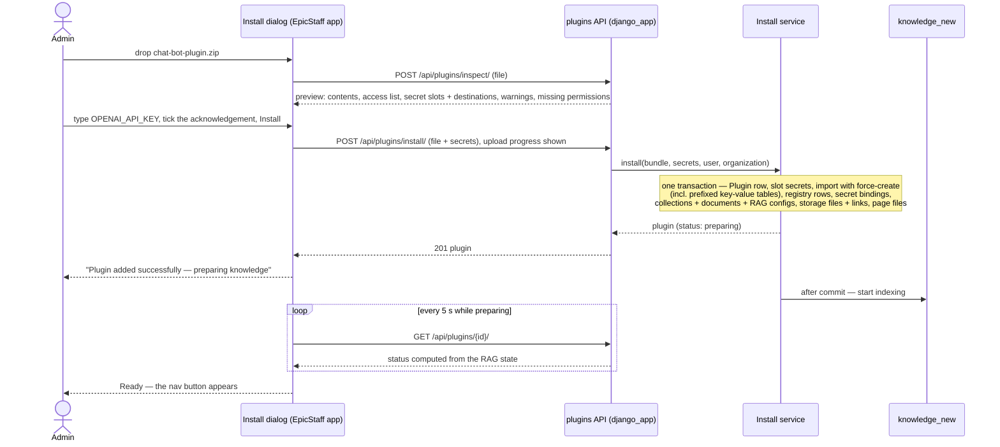

# Plugin package format (`format_version: 1`)

The contract between a **plugin author** and EpicStaff: what goes into the plugin file, what EpicStaff checks, and what
happens when it is installed. Validation lives in `src/django_app/plugins/manifest.py` and
`src/django_app/plugins/services/bundle_reader.py`; the CLI's `validate` mirrors it for authors
([[plugin-author-tooling]]). Architecture context: [[plugins-architecture]].

## Layout

A plugin file is a `.zip`. At its root (or inside one wrapping folder) only these entries are allowed:

```
chat-admin-plugin.zip
├── plugin.json        manifest — identity, bridge version, secret slots, knowledge, files, access list, UI entry
├── resources.json     an ordinary EpicStaff Flow export (import format v3), incl. key-value table definitions
├── knowledge/         documents that become knowledge collections
├── files/             files placed in EpicStaff storage
└── ui/                the plugin page or app build (types listed below)
```

`__MACOSX/` and `.DS_Store` are ignored. Limits: zip ≤ **30 MB**, ≤ **400** entries, ≤ **60 MB** unpacked.

## `resources.json` — reuse, not reinvention

Everything EpicStaff's import already understands stays in `resources.json`, unchanged: the flow and its nodes, agent
definitions, surfaces with their tools, Python and MCP tools, LLM and embedding configs (and their catalog models), and
**key-value tables**. Its `main_entity` must be `"Flow"`. Easiest way to author it: build the flow on a dev stack and
export it, or use the helper command `plugin_export_resources`
(`src/django_app/plugins/management/commands/plugin_export_resources.py`, `--sample chat-bot | chat-admin`).

A key-value table travels as a **definition only** — its rows never do:

```json
"KeyValueTable": [{"id": 1, "name": "conversations", "description": "One entry per chat conversation."}]
```

It is installed as `<plugin_id>__<name>` with every `-` in the plugin id turned into `_`, e.g.
`chat_admin__conversations` (≤ 255 characters). Every
key-value node in the flow must use a table the file ships; a node naming any other table rejects the file
([[plugins-rules]] S13). Plain (non-plugin) flow exports carry their tables the same way since this change; the import
format version stays 3 and older servers ignore the entity.

Inside `plugin.json`, a **`ref`** is the `id` an entity has *inside* `resources.json`. After import, EpicStaff maps refs to
the real database ids.

## `plugin.json` — what import cannot express

| Field | Meaning | Rules |
|---|---|---|
| `format_version` | Version of this file format | must be `1` |
| `bridge` | Bridge version the frontend is built for | `1` (simple page, [[plugin-bridge-v1]]) or `2` (app, [[plugin-bridge-v2]]) |
| `id` | Stable plugin id; one install per organization | lowercase id; never changes between versions |
| `version` | Plugin version | e.g. `0.1.0` |
| `name`, `description` | Shown in the Plugins tab and the nav button | |
| `icon` | Path to the nav icon inside `ui/` | real PNG or SVG, ≤ 64 KB |
| `ui.entry` | The frontend's HTML entry | an `.html` file inside `ui/`; omit `ui` for a plugin without a frontend |
| `secret_slots[]` | `{name, description}` — secrets the admin types at install | **no `value` field** — unknown keys are refused |
| `secret_bindings[]` | `{entity, ref, field, slot}` — put a slot's secret into a config field | e.g. `LLMConfig` / `EmbeddingConfig` `api_key_secret` |
| `knowledge[]` | `{name, description, embedder, documents[], attach_to_surfaces[]}` | `embedder` = ref of an `EmbeddingConfig`; documents under `knowledge/`; surfaces get the collection |
| `storage_files[]` | `{path, surfaces[{surface, can_list, can_view…}], attach_to_flows[]}` | file under `files/`; also attached to the flow, because an agent only sees files attached to its flow |
| `access[]` | `{alias, type, ref, actions[]}` — what the frontend may touch | `flow` → `run`, `sessions.read`, `sessions.stop`; `key_value_table` → `read`, and only with `bridge: 2` |

### The Chat Admin sample's `plugin.json` (bridge 2)

```json
{
  "format_version": 1,
  "bridge": 2,
  "id": "chat-admin",
  "version": "0.1.0",
  "name": "Chat Admin",
  "icon": "ui/icon.svg",
  "ui": { "entry": "ui/index.html" },
  "secret_slots": [{ "name": "OPENAI_API_KEY", "description": "OpenAI API key used by the chat model." }],
  "secret_bindings": [{ "entity": "LLMConfig", "ref": 1, "field": "api_key_secret", "slot": "OPENAI_API_KEY" }],
  "access": [
    { "alias": "chat", "type": "flow", "ref": 1, "actions": ["run", "sessions.read", "sessions.stop"] },
    { "alias": "conversations", "type": "key_value_table", "ref": 1, "actions": ["read"] }
  ]
}
```

Source: `plugin-samples/chat-admin/plugin/` + the app in `plugin-samples/chat-admin/app/`. Build the zip with the CLI:
`epicstaff-plugin pack plugin-samples/chat-admin/plugin --ui plugin-samples/chat-admin/app/dist/chat-admin/browser --out chat-admin-plugin.zip`.

### The chat-bot sample's `plugin.json` (bridge 1)

```json
{
  "format_version": 1,
  "bridge": 1,
  "id": "chat-bot",
  "version": "0.1.0",
  "name": "Chat Bot",
  "icon": "ui/icon.svg",
  "ui": { "entry": "ui/index.html" },
  "secret_slots": [{ "name": "OPENAI_API_KEY", "description": "OpenAI API key used by the chat model and by the knowledge embeddings." }],
  "secret_bindings": [
    { "entity": "LLMConfig", "ref": 1, "field": "api_key_secret", "slot": "OPENAI_API_KEY" },
    { "entity": "EmbeddingConfig", "ref": 1, "field": "api_key_secret", "slot": "OPENAI_API_KEY" }
  ],
  "knowledge": [{
    "name": "Acme Notes knowledge",
    "embedder": 1,
    "documents": ["knowledge/product-overview.md", "knowledge/faq.md"],
    "attach_to_surfaces": [1]
  }],
  "storage_files": [{
    "path": "files/tone-guide.md",
    "surfaces": [{ "surface": 1, "can_list": "allow", "can_view": "allow" }],
    "attach_to_flows": [1]
  }],
  "access": [{ "alias": "chat", "type": "flow", "ref": 1, "actions": ["run", "sessions.read", "sessions.stop"] }]
}
```

Source: `src/django_app/plugins/samples/chat-bot/`. Build the zip from inside that folder:
`zip -r -X chat-bot-plugin.zip plugin.json resources.json knowledge files ui`.

## What EpicStaff rejects

Every problem is reported at once (`400 invalid_plugin` with a list). The full list is in [[plugins-api-contract]] →
"What the server rejects"; in short:

- not a zip, over the limits, unsafe paths, executables, or anything unexpected at the root;
- unknown keys in `plugin.json` (so a slot carrying a `value` is refused), unsupported versions, duplicates, bindings to
  undeclared slots, access types or actions that don't match, a `key_value_table` entry with bridge 1, refs that are not
  entities of the right type in `resources.json`;
- `resources.json` that is not a Flow export, is newer than the server reads, carries entity types a plugin may not,
  has knowledge nodes bound to an existing collection, has key-value nodes using a table the file does not ship, table
  names that are blank, duplicated (any case) or too long once prefixed, or Python code that reads secrets by name
  (`get_secret("NAME")` — it would clash with the organization's own secret names);
- missing documents or files, unsupported document types;
- UI files outside the allowed types, more than **300** files or over **20 MB**, a bad entry or icon.

UI file types: `.html .js .mjs .css .json .map .txt .svg .png .jpg .jpeg .gif .webp .ico .woff .woff2 .ttf .otf`.

## Rules for plugin frontends (the sandbox)

The frontend runs in `<iframe sandbox="allow-scripts">` with an opaque origin (`null`) and this policy:
`sandbox allow-scripts; default-src 'none'; script-src 'self'; style-src 'self' 'unsafe-inline'; img-src 'self' data: blob:; font-src 'self' data:; connect-src 'none'; media-src 'none'; frame-src 'none'; worker-src 'none'; manifest-src 'none'; object-src 'none'; form-action 'none'; base-uri 'none'; frame-ancestors 'self'`.
Every file is served with `Access-Control-Allow-Origin: *`, so modules and fonts load from the opaque origin.

| Works | Does not work |
|---|---|
| Classic scripts **and ES modules**, lazy-loaded chunks (`import()`), `modulepreload` | Inline `<script>` code, `eval`, `new Function`, `javascript:` URLs, inline handlers (`onclick="…"`) |
| Web fonts shipped in `ui/` | Any outside network: `fetch`, XHR, WebSocket, CDNs, external fonts or images |
| Framework-injected styles (`<style>`, `style="…"`, CSS-in-JS) and `.css` files | `<base href>` (ignored; relative URLs already resolve inside the plugin's folder) |
| Hash routing (`#/path`) — bridge v2 keeps EpicStaff's URL in sync | Path routing (an opaque-origin page may only change its query and fragment) |
| Images from `ui/`, `data:` and `blob:` URLs | `localStorage`, `sessionStorage`, IndexedDB, cookies — use the SDK's in-memory stand-in |
| Buttons and inputs handled in JavaScript | Form submission (`submit` never fires), popups, `alert`/`confirm`, new windows, downloads, nested frames, workers, camera/mic/location |
| Talking to EpicStaff through the bridge | Opening a plugin file as a top-level page (answers 404) |

Page links stay valid for **12 hours**; after that a not-yet-loaded lazy chunk fails and reloading the page fixes it.
A bridge-1 page ships its own small bridge client (the chat-bot sample's `ui/bridge-client.js`); a bridge-2 app uses
the SDK ([[plugin-author-tooling]]).

## Install sequence



A plugin without knowledge (like Chat Admin) is `ready` straight after install.

## Related

- [[plugins-prd]] — [Plugins — product requirements](plugins-prd.md)
- [[plugins-rules]] — [Plugins — rules](plugins-rules.md)
- [[plugins-architecture]] — [Plugins — architecture](plugins-architecture.md)
- [[plugin-bridge-v1]] — [Plugin bridge v1](plugin-bridge-v1.md)
- [[plugin-bridge-v2]] — [Plugin bridge v2](plugin-bridge-v2.md)
- [[plugin-author-tooling]] — [Plugin author tooling: SDK, CLI, dev mode](plugin-author-tooling.md)
- [[plugins-api-contract]] — [Plugins API contract](api-contract.md)
- [[plugins-glossary]] — [Plugins glossary](plugins-glossary.md)
- [[plugins-code-map]] — [Plugins code map](code-map.md)
