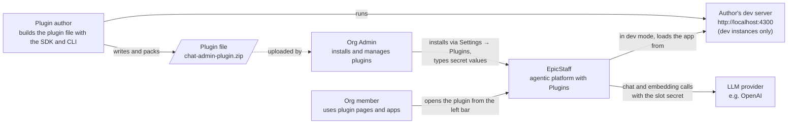
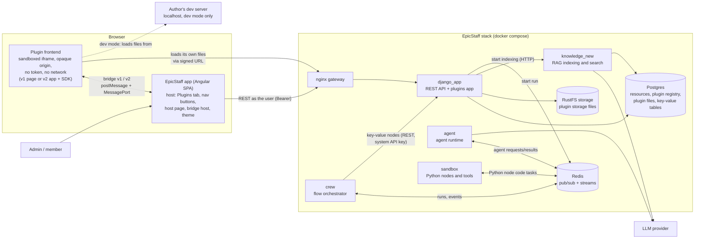
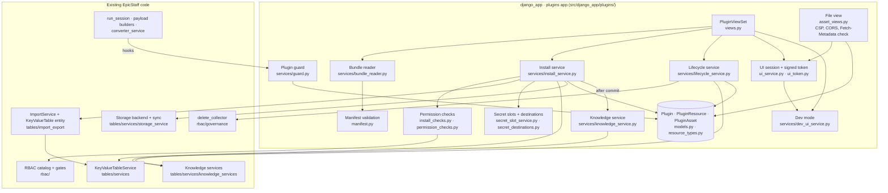
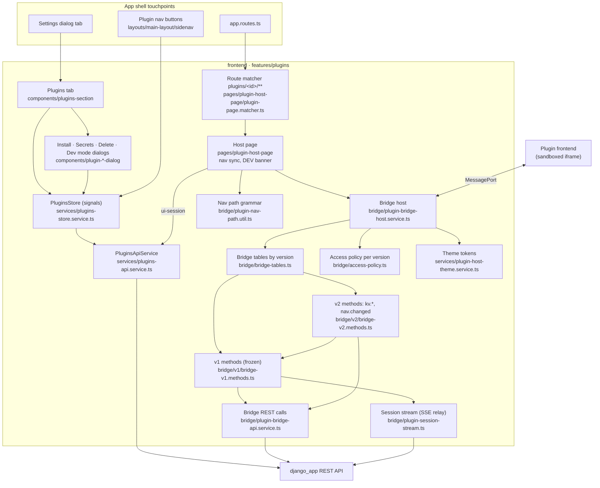

# Plugins — architecture

How Plugins sit on top of EpicStaff: what is reused, what is new, how the parts talk, and why it is built this way.
The *what* and *why* for users is in [[plugins-prd]]; the invariants are in [[plugins-rules]]; every file is listed in
[[plugins-code-map]]. Describes the prototype as built at `bfeea626f`.

## In one paragraph

A plugin file is unpacked and validated by a new Django app (`src/django_app/plugins/`). Its resources — flows,
agents, tools, configs, **key-value tables** — are created through EpicStaff's **existing** import pipeline and
services, inside one transaction, and recorded in a **registry** (`PluginResource`) so the plugin can later be
suspended or deleted as a unit. The plugin's frontend files are stored in the database and served to a **sandboxed
iframe** through signed URLs. In the browser, the EpicStaff app acts as the **host**: the plugin frontend talks to it
over a **versioned bridge** (postMessage + MessagePort), and the host calls the normal REST API as the logged-in user,
limited by the plugin's access list. Bridge v1 serves simple pages (run a flow, watch its runs); bridge v2 serves full
apps (plus reading the plugin's tables, deep links and live theme). A **guard** at EpicStaff's single run entry point
refuses runs of a suspended plugin. On a dev instance, an admin can point an installed plugin at a localhost dev server.

## Relation to EpicStaff: reused vs new

| Concern | Reused from EpicStaff | New for Plugins |
|---|---|---|
| Creating flows, agents, tools, configs | Import pipeline `tables/import_export/` (`ImportService`, strategies, `IDMapper`) | `force_create_types` option so install never reuses existing rows |
| Key-value tables | `KeyValueTable` model, `KeyValueTableService`, key-value node, entries REST API | `KeyValueTable` **export entity** (definition only, no rows) — flow exports now carry their tables; key-value nodes bind to the imported table first; exact `key` filter on the entries API |
| Secrets | `Secret` model + `secret_service` (encrypted values) | Secret **slots** declared by the plugin; destinations shown at review |
| Knowledge | Collection, document and naive-RAG services; `knowledge_new` indexing | Background indexing kick-off + status computed from RAG state |
| Files | Storage backend + storage sync | Files written under `plugins/<id>/` and linked to the agent's surface and the flow |
| Permissions | RBAC catalog, gates, org scoping, built-in roles | New `plugins` resource type; install/delete permission checks across contained types |
| Running flows | `SessionManagerService.run_session`, session SSE | Guard hook before a session is created; agent, tool and key-value table hooks |
| Delete preview | `rbac/governance/delete_collector.py` | Preview + ordered removal through owning services |
| Settings, navigation, routing | Settings dialog tabs, sidenav, router, permission guard | Plugins tab, dynamic plugin buttons, `/plugins/<id>/**` host page with a URL matcher for deep links |
| Look and feel | EpicStaff's CSS variables (`_variables.scss`), dark/light class | A stable public **theme token** set (`--es-…`) pushed to the app |
| Browser ↔ backend | `HttpClient` + interceptors (Bearer token) | Bridge host — the only way a plugin frontend reaches the API |
| Instance settings | `env.yaml` → compose → Django settings | `PLUGINS_DEV_MODE` flag |

## C4 level 1 — System context

## C4 level 2 — Containers

The plugin frontend never talks to `django_app` for data: the only request it can make is loading its own files. All
data goes **frame → bridge → host → REST**. Writes to a plugin's table happen only inside its flows (crew's key-value
nodes call django_app with the system API key) — the app itself can only read.

## C4 level 3 — Components: backend `plugins` app

| Component | Responsibility |
|---|---|
| `views.py` — `PluginViewSet` | All `/api/plugins/` actions; org-scoped; maps each action to a `plugins:` permission ([[plugins-api-contract]]) |
| `services/bundle_reader.py` | Safe unzip (30 MB, 400 entries, 60 MB unpacked; sanitised names; wrapping folder tolerated) |
| `manifest.py` | Validates `plugin.json` + `resources.json`; access types per bridge version; key-value tables only the plugin ships; prefixed names; every rejection rule ([[plugin-package-format]]) |
| `services/install_service.py` | `inspect` (preview, no writes) and `install` (one transaction) |
| `services/install_checks.py`, `permission_checks.py` | Create-on-every-type (+ key-value node mode permissions) at install; delete-on-every-type at uninstall; name conflicts |
| `services/secret_slot_service.py`, `secret_destinations.py` | Re-entering slot values; where each slot's value is sent |
| `services/knowledge_service.py` | Starts indexing after commit; computes `preparing / ready / needs_attention`; retry |
| `services/lifecycle_service.py` | Suspend, resume, delete preview, ordered delete (tables and their rows included) |
| `services/guard.py` | Refuses suspended plugins' flows, agents, tools and key-value tables |
| `services/ui_service.py`, `ui_token.py`, `asset_views.py` | Signed 12 h page URLs; serving page files with the sandbox headers; refusing top-level document loads |
| `services/dev_ui_service.py` | Validates, sets and clears a plugin's dev URL; decides per user whether the dev URL is served |
| `models.py`, `resource_types.py` | `Plugin` (incl. `dev_ui_url`, `dev_ui_user`), the `PluginResource` registry, `PluginAsset`; the registry's own type names |

**Hooks added outside the app:** `tables/services/session_manager_service.py` (`run_session`, before `create_session`),
`tables/services/base_node_payload_service.py` (agent definitions), `tables/services/converter_service.py` (tools and
key-value tables), `tables/views/views.py` (`RunSession` returns 409 `plugin_suspended`), `tables/import_export/`
(`force_create_types`, the `KeyValueTable` entity, graph dependencies, key-value node binding),
`tables/views/model_view_sets.py` (exact `key` filter on key-value entries).

## C4 level 3 — Components: frontend `features/plugins` (the host)

| Component | Responsibility |
|---|---|
| `components/plugins-section/` | The Settings tab: list, status badges, Secrets / Retry / Suspend / Resume / Delete / Dev mode (each permission-gated); DEV badge |
| `components/plugin-install-dialog/` | Drop → inspect → review (contents, access list, secret slots with destinations, acknowledgement) → upload progress → done |
| `components/plugin-secrets-dialog/`, `plugin-delete-dialog/`, `plugin-dev-mode-dialog/` | Fix a secret and retry; delete preview and confirmation; set or clear a dev URL |
| `services/plugins-store.service.ts` | Signals store; clears on org switch; polls while a plugin is preparing; supplies the nav buttons |
| `pages/plugin-host-page/plugin-page.matcher.ts` | Consumes `plugins/<id>/**` so app paths reach the host page; rejects matrix params |
| `pages/plugin-host-page/` | Opens a UI session, validates the URL, renders the static sandboxed iframe; turns the route into the app's initial path and keeps the two in sync; DEV banner |
| `bridge/plugin-bridge-host.service.ts` | Handshake, envelope, limits, page-scoped sessions, host events (`nav.navigate`, `theme.changed`), dev re-handshake, teardown |
| `bridge/bridge-tables.ts`, `v1/`, `v2/` | `BRIDGE_TABLES = {1: V1, 2: V2}`; v2 reuses v1's handlers and adds `kv.list`, `kv.get`, `nav.changed`; each pinned by its contract spec |
| `bridge/access-policy.ts` | Alias → resource id + allowed actions, with the access types each bridge version knows |
| `bridge/plugin-nav-path.util.ts` | The path grammar; app path ⇄ router segments and query |
| `services/plugin-host-theme.service.ts` | Reads EpicStaff's CSS variables into the `--es-…` token set; watches dark/light |
| `bridge/plugin-bridge-api.service.ts`, `plugin-session-stream.ts` | The REST calls bridge methods make; one SSE stream per subscription relayed as events |

The plugin side of the bridge — SDK, nav sync, theme, storage stand-in, mock host — is drawn in
[[plugin-author-tooling]].

## Key decisions

| Decision | Chosen | Why | Rejected alternative |
|---|---|---|---|
| What a plugin is | **A resource, not an identity** | No service account to secure; the frontend acts as the user, so it can never exceed the user's rights | A service-app identity with its own permissions (privilege escalation through the plugin page) |
| Linking installed rows | **Registry table** `PluginResource` with the plugin's own type names | Tables, import/export and copy code stay unaware of plugins; one place knows what a plugin installed; survives model moves | A `plugin` foreign key on ~10 models (copied by duplicate/export, invasive) |
| Frontend files | **Stored in Postgres** (`PluginAsset`) | Atomic with install, deleted with the plugin, backed up, survive upgrades | Container filesystem (lost on rebuild) or object storage (not transactional) |
| Page authentication | **Signed, reusable URL token**, re-checked on every request; **12 h** so lazy chunks still load in a long session | An app loads many files over time; the existing SSE ticket is single-use | Passing the user's token into the page (EpicChat's pattern); 10-minute tokens (broke lazy loading) |
| Isolation | **Sandboxed iframe** (opaque origin) + strict CSP + MessagePort bridge | The plugin frontend is untrusted code | Loading plugin code into the EpicStaff app (Module Federation): full access, version lock-step |
| Cross-origin headers on plugin files | `Cross-Origin-Resource-Policy: cross-origin` + `Access-Control-Allow-Origin: *` | An opaque-origin page needs CORS to load its own modules and fonts; nothing served is credentialed | `same-origin` / no CORS (breaks every framework build) |
| Leaked page links | **Fetch Metadata check**: documents only into a frame | A token URL opened top-level would be a page on EpicStaff's domain | Shorter tokens (doesn't stop it, breaks apps) |
| Enforcing suspend | **Guard at `run_session` before a session row exists**, plus agent, tool and table hooks | Every run route passes there; no error rows | Filtering each trigger type separately |
| Import reuse | **Force-create** for plugin-owned types | Reusing an existing row would let suspend/delete hit the organization's data | The importer's default reuse-by-content |
| Shipping tables | **Export entity, definition only**; installed with the plugin prefix; flows may use only shipped tables | Portable like other entities; rows are data, not definition; blocks reading org tables | Rows in the file; by-name binding to any org table |
| What the app can do with tables | **Read only**, pinned to the granted table, ids stripped | The flow owns writes; minimal surface for an untrusted page | Read + write from the app |
| Runs a page may read | **Only runs the open page started** | Stops a plugin from reading other users' chats | Any run of the plugin's flow |
| Bridge evolution | **One frozen method table per version** (`BRIDGE_TABLES`) | Old pages keep working; new apps get new methods | Changing v1 in place |
| Deep links | **Hash routing inside the frame; the host owns history** (the SDK turns `pushState` into `replaceState` + `nav.changed`) | An opaque-origin page cannot change its path, and its own history entries would double every Back | Path routing in the frame; letting the frame push history |
| Plugin URL | `/plugins/<database id>/<app path>` | Unique and already used by the API | The manifest slug (not unique across reinstalls; deferred) |
| Chat transcript | **The flow keeps it in the table**; the app sends only `{conversation_id, question}` | The bridge caps requests at 64 KB; the table is the single source of truth | The app sends the transcript every turn |
| Dev mode | **Instance flag + per-admin localhost URL + DEV banner** | Real data and real bridge while iterating; impossible in production | Re-uploading the plugin on every change; a mock-only loop |
| Nav buttons for use-only roles | Separate `GET /api/plugins/nav/` needing `use` | Keeps `read` (see the tab) and `use` (open the page) apart; leaks nothing else | Letting `use` call the full list |

## Known gaps

- While suspended, the scheduler keeps firing (Django refuses each run) and realtime agents are not guarded; the
  plugin's table stays readable through EpicStaff's own Key-Value Tables page.
- A webhook path matching several flows stops at the first refused (suspended) one.
- Indexing starts inside the install request, so install can take ~10 s longer per knowledge collection.
- The page token is signed, not encrypted: the page can read the plugin, organization and user ids in it.
- Light mode can't be switched from EpicStaff's UI today (nothing applies `.my-app-light`); detection works.
- In dev mode any page loaded in the frame gets the bridge with the dev admin's permissions (the banner says so).
- Safari 26.4 showed a white plugin frame on 2026-10-07 while Chrome and WebKit 26.6 work; not diagnosed.
- Update / downgrade / reinstall, access-list narrowing and secrets in the app are not built yet.

## Related

- [[plugins-prd]] — [Plugins — product requirements](plugins-prd.md)
- [[plugins-rules]] — [Plugins — rules](plugins-rules.md)
- [[plugin-package-format]] — [Plugin package format](plugin-package-format.md) (includes the install sequence)
- [[plugin-bridge-v1]] — [Plugin bridge v1](plugin-bridge-v1.md) (includes the bridge sequence)
- [[plugin-bridge-v2]] — [Plugin bridge v2](plugin-bridge-v2.md)
- [[plugin-author-tooling]] — [Plugin author tooling: SDK, CLI, dev mode](plugin-author-tooling.md) (the plugin side)
- [[plugins-api-contract]] — [Plugins API contract](api-contract.md)
- [[plugins-glossary]] — [Plugins glossary](plugins-glossary.md)
- [[plugins-code-map]] — [Plugins code map](code-map.md)
