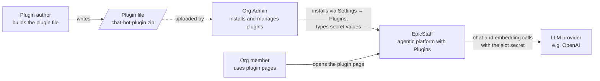
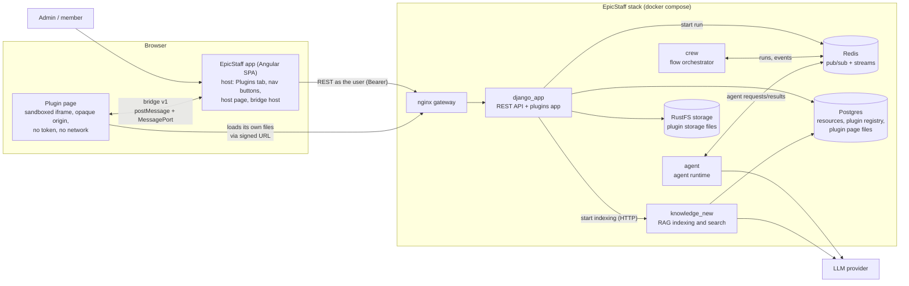
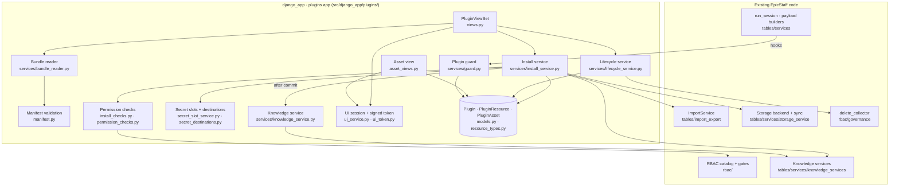
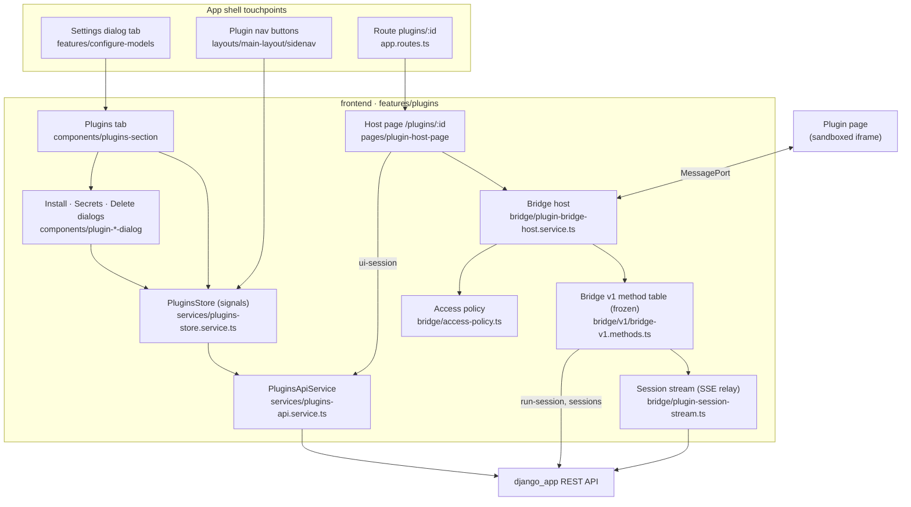

# Plugins — architecture

How Plugins sit on top of EpicStaff: what is reused, what is new, how the parts talk, and why it is built this way.
The *what* and *why* for users is in [[plugins-prd]]; the invariants are in [[plugins-rules]].

## In one paragraph

A plugin file is unpacked and validated by a new Django app (`src/django_app/plugins/`). Its resources are created
through EpicStaff's **existing** import pipeline and services, inside one transaction, and recorded in a **registry**
(`PluginResource`) so the plugin can later be suspended or deleted as a unit. The plugin's page files are stored in the
database and served to a **sandboxed iframe** through signed URLs. In the browser, the EpicStaff app acts as the **host**:
the plugin page talks to it over a **bridge** (postMessage + MessagePort), and the host calls the normal REST API as the
logged-in user, limited by the plugin's access list. A **guard** at EpicStaff's single run entry point refuses runs of a
suspended plugin.

## Relation to EpicStaff: reused vs new

| Concern | Reused from EpicStaff | New for Plugins |
|---|---|---|
| Creating flows, agents, tools, configs | Import pipeline `tables/import_export/` (`ImportService`, strategies, `IDMapper`) | `force_create_types` option so install never reuses existing rows |
| Secrets | `Secret` model + `secret_service` (encrypted values) | Secret **slots** declared by the plugin; destinations shown at review |
| Knowledge | Collection, document and naive-RAG services; `knowledge_new` indexing | Background indexing kick-off + status computed from RAG state |
| Files | Storage backend + storage sync | Files written under `plugins/<id>/` and linked to the agent's surface and the flow |
| Permissions | RBAC catalog, gates, org scoping, built-in roles | New `plugins` resource type; install/delete permission checks across contained types |
| Running flows | `SessionManagerService.run_session`, session SSE | Guard hook before a session is created; agent/tool hooks |
| Delete preview | `rbac/governance/delete_collector.py` | Preview + ordered removal through owning services |
| Settings, navigation, routing | Settings dialog tabs, sidenav, router, permission guard | Plugins tab, dynamic plugin buttons, `/plugins/:id` host page |
| Browser ↔ backend | `HttpClient` + interceptors (Bearer token) | Bridge host — the only way a plugin page reaches the API |

## C4 level 1 — System context

## C4 level 2 — Containers

The plugin page never talks to `django_app` for data: the only request it can make is loading its own files. All data
goes **frame → bridge → host → REST**.

## C4 level 3 — Components: backend `plugins` app

| Component | Responsibility |
|---|---|
| `views.py` — `PluginViewSet` | All `/api/plugins/` actions; org-scoped; maps each action to a `plugins:` permission ([[plugins-api-contract]]) |
| `services/bundle_reader.py` | Safe unzip (size and entry caps, sanitised names, wrapping folder tolerated) |
| `manifest.py` | Validates `plugin.json` + `resources.json`; every rejection rule ([[plugin-package-format]]) |
| `services/install_service.py` | `inspect` (preview, no writes) and `install` (one transaction) |
| `services/install_checks.py`, `permission_checks.py` | Create-on-every-type (install) and delete-on-every-type (uninstall) checks |
| `services/secret_slot_service.py`, `secret_destinations.py` | Re-entering slot values; where each slot's value is sent |
| `services/knowledge_service.py` | Starts indexing after commit; computes `preparing / ready / needs_attention`; retry |
| `services/lifecycle_service.py` | Suspend, resume, delete preview, ordered delete |
| `services/guard.py` | Refuses suspended plugins' flows, agents and tools |
| `services/ui_service.py`, `ui_token.py`, `asset_views.py` | Signed page URLs; serving page files with the sandbox headers |
| `models.py`, `resource_types.py` | `Plugin`, the `PluginResource` registry, `PluginAsset`; the registry's own type names |

**Hooks added outside the app:** `tables/services/session_manager_service.py` (`run_session`, before `create_session`),
`tables/services/base_node_payload_service.py` (agent definitions), `tables/services/converter_service.py` (tools),
`tables/views/views.py` (`RunSession` returns 409 `plugin_suspended`), and `tables/import_export/` (`force_create_types`).

## C4 level 3 — Components: frontend `features/plugins`

| Component | Responsibility |
|---|---|
| `components/plugins-section/` | The Settings tab: list, status badges, Secrets / Retry / Suspend / Resume / Delete (each permission-gated) |
| `components/plugin-install-dialog/` | Drop → inspect → review (contents, access list, secret slots with destinations, acknowledgement) → upload progress → done |
| `components/plugin-secrets-dialog/`, `plugin-delete-dialog/` | Fix a secret and retry; delete preview and confirmation |
| `services/plugins-store.service.ts` | Signals store; clears on org switch; polls while a plugin is preparing; supplies the nav buttons |
| `pages/plugin-host-page/` | Opens a UI session, validates the URL, renders the static sandboxed iframe |
| `bridge/plugin-bridge-host.service.ts` | Handshake, envelope, limits, page-scoped sessions, teardown ([[plugin-bridge-v1]]) |
| `bridge/access-policy.ts` | Alias → resource id + allowed actions, from the UI-session response |
| `bridge/v1/bridge-v1.methods.ts` | The frozen public method table; pinned by `bridge-v1.contract.spec.ts` |
| `bridge/plugin-session-stream.ts` | One SSE stream per subscription, relayed to the page as events |

## Key decisions

| Decision | Chosen | Why | Rejected alternative |
|---|---|---|---|
| What a plugin is | **A resource, not an identity** | No service account to secure; the page acts as the user, so it can never exceed the user's rights | A service-app identity with its own permissions (privilege escalation through the plugin page) |
| Linking installed rows | **Registry table** `PluginResource` with the plugin's own type names | Tables, import/export and copy code stay unaware of plugins; one place knows what a plugin installed; survives model moves | A `plugin` foreign key on ~10 models (copied by duplicate/export, invasive) |
| Page files | **Stored in Postgres** (`PluginAsset`) | Atomic with install, deleted with the plugin, backed up, survive upgrades | Container filesystem (lost on rebuild) or object storage (not transactional) |
| Page authentication | **Signed, reusable, 10-minute URL token**, re-checked on every request | An iframe loads many files; the existing SSE ticket is single-use | Passing the user's token into the page (EpicChat's pattern) |
| Isolation | **Sandboxed iframe** (opaque origin) + strict CSP + MessagePort bridge | The plugin page is untrusted code | Loading plugin code into the EpicStaff app (Module Federation): full access, version lock-step |
| Cross-origin policy on page files | `Cross-Origin-Resource-Policy: cross-origin` | An opaque-origin page could not load its own scripts under `same-origin`; the token is the protection | `same-origin` (breaks every plugin page) |
| Enforcing suspend | **Guard at `run_session` before a session row exists**, plus agent and tool hooks | Every run route passes there; no error rows | Filtering each trigger type separately |
| Import reuse | **Force-create** for plugin-owned types | Reusing an existing row would let suspend/delete hit the organization's data | The importer's default reuse-by-content |
| Runs a page may read | **Only runs the open page started** | Stops a plugin from reading other users' chats | Any run of the plugin's flow |
| Nav buttons for use-only roles | Separate `GET /api/plugins/nav/` needing `use` | Keeps `read` (see the tab) and `use` (open the page) apart; leaks nothing else | Letting `use` call the full list |

## Known gaps

- While suspended, the scheduler keeps firing (Django refuses each run) and realtime agents are not guarded.
- A webhook path matching several flows stops at the first refused (suspended) one.
- Indexing starts inside the install request, so install can take ~10 s longer per knowledge collection.
- The page token is signed, not encrypted: the page can read the plugin, organization and user ids in it.
- Update / downgrade / reinstall and access-list narrowing are not built yet.

## Related

- [[plugins-prd]] — [Plugins — product requirements](plugins-prd.md)
- [[plugins-rules]] — [Plugins — rules](plugins-rules.md)
- [[plugin-package-format]] — [Plugin package format](plugin-package-format.md) (includes the install sequence)
- [[plugin-bridge-v1]] — [Plugin bridge v1](plugin-bridge-v1.md) (includes the bridge sequence)
- [[plugins-api-contract]] — [Plugins API contract](api-contract.md)
- [[plugins-glossary]] — [Plugins glossary](plugins-glossary.md)
